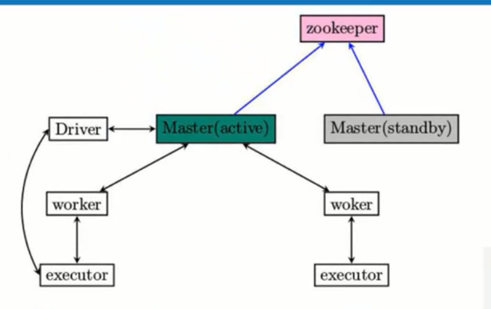

# 第12课：HA下的Spark集群工作原理解密

标签（空格分隔）： sparkIMF

---

##HA

推荐Spark 3台机器做HA

##zookeeper中包括哪里内容：
    所有的Worker、Driver、Application

##只有standby模式的Master恢复了整个集群的状态， 它才能对外提供服务

    active级别的Master挂掉以后，zookeeper会根据自己的选举机制，从standby的Master中选取一个作为leader，这个leader从standby模式变成active模式的话，它要做的最重要的步骤就是从zookeeper中获取整个集群的状态信息。恢复整个集群的Worker、Application、Drivers的所有的这些信息，这样它才能接管整个集群的工作，而也只有成功恢复完成之后，此时被选为leader的Master才会从standby到recovery，然后到正式的active级别，只有到了active级别，才能够接受新的作业提交的请求。

##例如说一个程序正在运行会不会因为Master的切换，而影响了这个程序的运行呢？
    不会，原因是：程序在具体运行之前，已经向Master申请过资源了。申请过之后就是Driver与我们所有Worker分配的executors进行通信，这个过程一般情况下不需要Master参与。除非说你的executor有故障，所以在我们的Master出现故障进行切换的时候并不影响已有的作业的运行。
    
    要点就是：程序在与进行之前已经分配好资源了。
    
    粗粒度就是一次分配好资源，你后面就直接使用和复用资源。好处：一次性分配资源之后不需要再关心资源的分配，而在运行的过程中可以让Driver和Executors进行交互完成整个作业或程序的运行；弊端是：如果说我们这个job有100万个任务如果有1个任务没有运行完的话，那这个任务就是没有运行完。是不是为这100万个任务分配的计算资源都会闲置在那里
    所谓细粒度就是就是说你需要资源的时候再分配，使用完资源立即释放。弊端是：任务启动慢，没办法复用，而且确实有通讯的麻烦。

##动手实现Spark高可用HA

###配置Zookeeper

* 配置zookeeper环境变量
* 安装在多台机器上，scp分发
* 创建data、log目录
* dataDir必须修改，临时文件夹，如果不修改，重新启动之后会删除
* 配置zoo.cfg文件
    > dataDir=/usr/local/zookeeper/data
    > dataLOgDir=/usr/local/zookeeper/logs
    > server.0=Master:2888:3888
    > server.1=Worker3:2888:3888
    > server.2=Worker4:2888:3888
* data目录下创建myid文件，添加内容0。三台对应0、1、2：vim myid
* scp -r /usr/local/zookeeper-3.4.8/ root@Worker3:/usr/local/zookeeper-3.4.8
* scp -r /usr/local/zookeeper-3.4.8/ root@Worker4:/usr/local/zookeeper-3.4.8
* 修改myid：ssh Worker3     ； vim  /usr/local/zookeeper-3.4.8/data/myid为1
* 修改myid：ssh Worker4     ； vim /usr/local/zookeeper-3.4.8/data/myid为2
* 可以启动zookeeper：zkServer.sh start
* 启动后jps验证是否有QuorumPeerMain进程是否存在？

###配置Spark
* 配置spark-env.sh文件
export SPARK_DAEMON_JAVA_OPTS="-Dspark.deploy.recoveryMode=ZOOKEEPER -Dspark.deploy.zookeeper.url=Master:2181,Worker3:2181,Worker4:2181 -Dspark.deploy.zookeeper.dir=/spark"
注释掉SPARK_MASTER_IP
* 启动Spark，此时Spark只会启动一个Master，则手动启动Worker3和Worker4的Spark Master
* ./start-master.sh

##测试HA
* ./spark-shell --master spark://Master:7077,Worker3:7077,Worker4:7077
程序中连接了3台Master，最后肯定是只跟作为Active级别的Master进行交互。
* 关闭Master：./stop-master.sh
* 此时spark-shell终端提示
> Connection to Master:7077 failed;waiting for master to reconnect... 
之后会连接另一个Master：Master has changed, new master is at spark://Worker3:7077
这里不可能立即切换，因为有集群状态信息，有Workers、Drivers、Applications，这些信息需要恢复，恢复需要时间，一般情况下视集群规模而言可能说就分钟级别的恢复。
* 新的Master这个资源一定跟刚才挂掉的Master资源是一致的，因为资源是被zookeeper保存的。所以我们处于standby模式的Master变成active级别，这个过程其实就是恢复曾经失败的Master所具有的集群的状态的信息，而此时我们已经完成了这样的一个过程。
