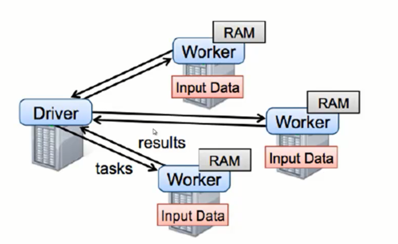
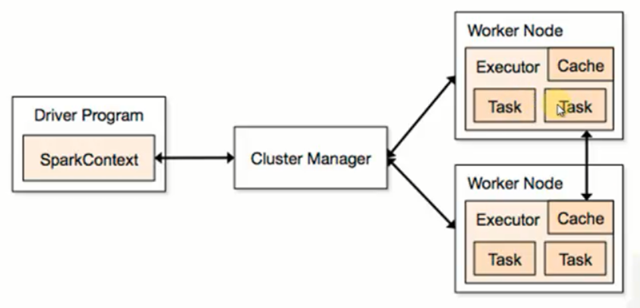
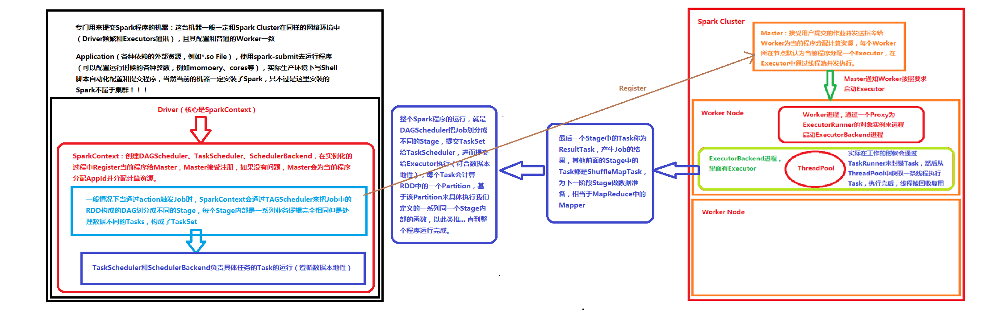

# 第13课：Spark内核架构解密

标签： sparkIMF

---

Spark默认运行standalong模式，由于是自带的，效率本身比yarn好很多

##SparkRuntime

##SparkContext是整个程序运行调度的核心

SparkContext创建的时候要有高层调度器TAGScheduler、底层调度器TaskScheduler也有SchedulerBackend。
除了创建对象，在创建对象的过程中，向Master注册当前的程序，如果注册没问题，Master会向它分配资源。

高层调度器就是把我们整个作业划分成几个小的阶段，底层调度器就是每个阶段里面的任务该具体怎么去处理。

##应用程序其实就是用户编写的spark代码打包或jar包和相关的依赖，它里面包含了Driver功能的代码和分布在集群中多个Executor的代码。
    Application=Driver+Executor
    
Driver部分的代码：SparkConf+SparkContext
executor中执行的代码：textFile、flatMap、map

##Spark Cluster

##Executor
Executor是运行在Worker所在的节点上为当前应用程序而开启的进程里的一个对象，这个对象负责了具体Task的运行。如何负责：是通过线程池并发执行和线程复用的方式。
一个Worker会在默认情况下为当前的应用程序只开辟一个Executor，当然可以配置多个！

Spark Application的运行不依赖于Cluster Manager。也就是说Spark应用程序注册给Cluster Manager，例如说Master注册如果是成功的，Master此时就已经提前给它分配好了资源。运行的过程中根本就不需要Cluster Manager的参与。这种资源分配的方式就是粗粒度的方式。

Worker上是不会运行我们程序的代码的，Worker是管理当前这个节点（Node）的内存、CPU等资源的使用状况的，它会接收Master分配资源（Executor）并通过ExecutorRunner来具体启动一个新进程，进程里面有Executor

**Worker管理当前Node的计算资源，并接收Master的指令来分配具体的计算资源Executor（在新的进程中分配）**

ExecutorRunner相当于Proxy

Worker会不会向Master汇报当前机器的内存、CPU的信息？ 
不会！Worker发心跳只发送WorkerID
Master分配的时候会记录资源

Job：就是包含了一系列Task并行计算，它在spark中会由Action触发

Action会不会产生RDD？ 不会，Acting会产生新的Job。

Spark之所以快，不是因为它基于内存，最基本的是它的调度和容错。

依赖有两种情况：
宽依赖：一对多
窄依赖：一对一

窄依赖还有个Range级别的窄依赖，就是依赖固定个数，所谓固定个数就是你不会随着数据规模的扩大而改变依赖个数的关系。

**窄依赖除了一对一的依赖以外，还有一种情况就是Range级别的。依赖固定个数的父RDD的Partition，而依赖的固定个数不会随着计算规模的大小而改变。**

依赖构成了DAG

Stage内部：计算逻辑完全一样，只是计算的数据不同罢了。

一个Application里面可以有多个Jobs

一般情况下一个Action操作对应一个Job，其他情况checkpoint、sort也会导致job。

##Spark的程序的运行有两种模式：Client Cluster

默认建议使用Client模式

我们除了构建Spark集群以外，我们要专门拿一台跟普通Worker配置一样的机器来做专门提交Spark程序的机器，提交的这台机器和普通的Worker配置是一致的，同时和Spark Cluster在同样的网络环境中（因为Driver频繁和Executors通讯）。

Driver做HA，可以在spark-submit的时候指定参数：--supervise，此时Driver挂掉之后集群会帮你启动Driver。

##Master如何知道向Worker分配多少资源
 1. spark-env.sh和spark-defualt.sh
 2. spark-submit提供的参数
 3. 程序中SparkConf配置的参数

##Spark内核架构图

