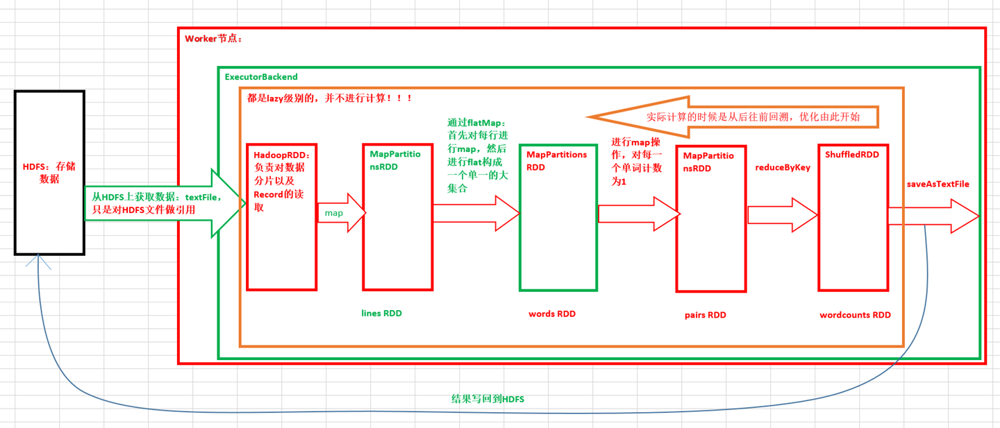

# 第16课：RDD实战（RDD基本操作实战及Transformation流程图）

标签： sparkIMF

---

##RDD的操作

* Transformation
* Action
* Controller


Transformation：针对已有的RDD创建一个新的RDD
Action：主要是对RDD进行最后取结果的操作，由于RDD设置，它是lazy级别的，它的性能非常高


map方法源码解读：
```scala
 /**
   * Return a new RDD by applying a function to all elements of this RDD.
   */
  def map[U: ClassTag](f: T => U): RDD[U] = withScope {
    val cleanF = sc.clean(f)
    new MapPartitionsRDD[U, T](this, (context, pid, iter) => iter.map(cleanF))
  }
```
reduce方法源码解读：
```scala
/**
   * Reduces the elements of this RDD using the specified commutative and
   * associative binary operator.
   */
  def reduce(f: (T, T) => T): T = withScope {
    val cleanF = sc.clean(f)
    val reducePartition: Iterator[T] => Option[T] = iter => {
      if (iter.hasNext) {
        Some(iter.reduceLeft(cleanF))
      } else {
        None
      }
    }
    var jobResult: Option[T] = None
    val mergeResult = (index: Int, taskResult: Option[T]) => {
      if (taskResult.isDefined) {
        jobResult = jobResult match {
          case Some(value) => Some(f(value, taskResult.get))
          case None => taskResult
        }
      }
    }
    sc.runJob(this, reducePartition, mergeResult)
    // Get the final result out of our Option, or throw an exception if the RDD was empty
    jobResult.getOrElse(throw new UnsupportedOperationException("empty collection"))
  }
```


##统计文件中相同的行出现的总次数
```scala
package com.dt.spark.sparkapps.streaming

import org.apache.spark.{SparkConf, SparkContext}

/**
 * 统计文件中相同的行出现的总次数
 * Created by Limaoran on 2016/5/10.
 */
object TextLines {
  def main(args: Array[String]) {
    val sc = new SparkContext(new SparkConf().setAppName("Text Lines").setMaster("local"))

    //通过HadoopRDD以及MapPartitionsRDD获取文件中每一行的内容本身
    val rdd = sc.textFile("G:\\txt\\test\\testLine.txt")
    //每一行变成行的内容与1构成的Tuple
    val linesCount = rdd.map(line=>(line,1)).reduceByKey(_+_)

    linesCount.collect().foreach(map=>println(map._1+":"+map._2))
  }
}
```


###collect方法源码解读：
**collect本身是把集群中处理的数据的各个节点上的内容收集过来，汇总之后变成最终的结果。**
Collect后的Array中就是一个元素，只不过是这个元素是一个Tuple
```scala
  /**
   * Return an array that contains all of the elements in this RDD.
   */
  def collect(): Array[T] = withScope {
    val results = sc.runJob(this, (iter: Iterator[T]) => iter.toArray)
    Array.concat(results: _*)
  }
```

###reduceByKey(_+_,1)
并行度为1会导致最后产生的结果只有一个文件！

###saveAsTextFile()
如果想只有一个文件，唯一的办法就是控制最后的并行度

##一张图说明WordCount的执行过程


