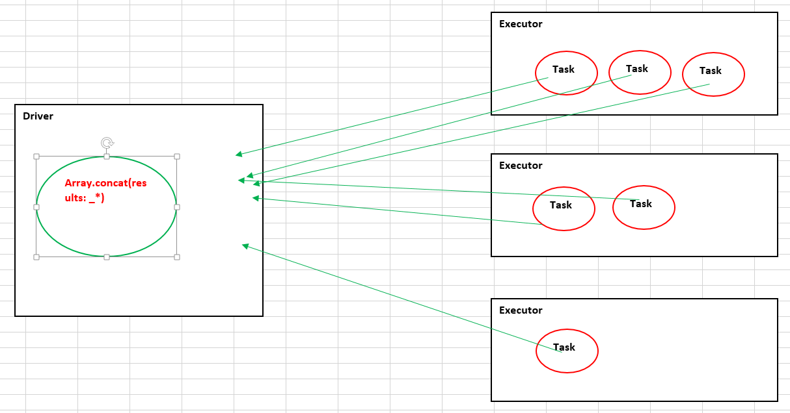
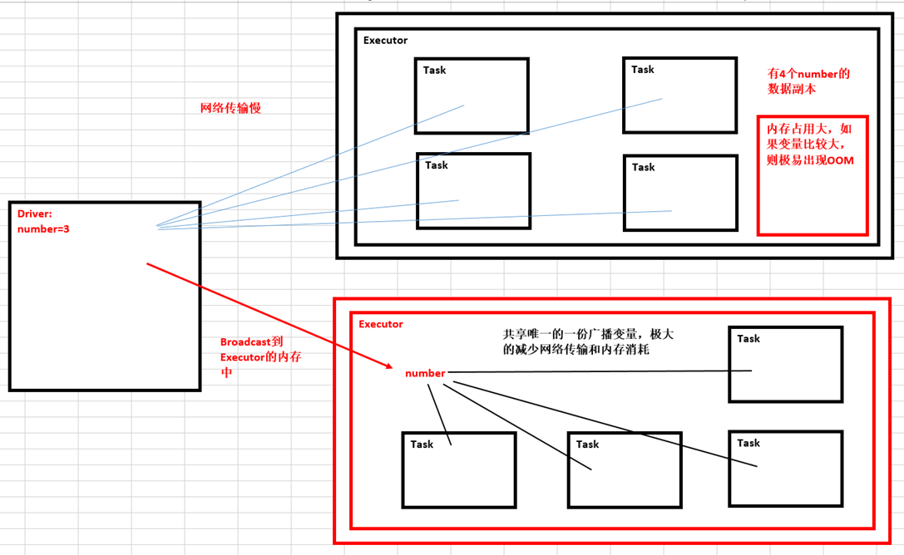

# 第18课：RDD持久化、广播、累加器

标签： sparkIMF

---

持久化是在实际生产环境下做RDD一个至关重要的内容。

##Action
凡是Action级别的操作，都会触发sc.runJob

###reduce

```scala
 /**
   * Reduces the elements of this RDD using the specified commutative and
   * associative binary operator.
   */
  def reduce(f: (T, T) => T): T = withScope {
    val cleanF = sc.clean(f)
    val reducePartition: Iterator[T] => Option[T] = iter => {
      if (iter.hasNext) {
        Some(iter.reduceLeft(cleanF))
      } else {
        None
      }
    }
    var jobResult: Option[T] = None
    val mergeResult = (index: Int, taskResult: Option[T]) => {
      if (taskResult.isDefined) {
        jobResult = jobResult match {
          case Some(value) => Some(f(value, taskResult.get))
          case None => taskResult
        }
      }
    }
    sc.runJob(this, reducePartition, mergeResult)
    // Get the final result out of our Option, or throw an exception if the RDD was empty
    jobResult.getOrElse(throw new UnsupportedOperationException("empty collection"))
  }

val numbers = sc.parallelize(1 to 100)
numbers.reduce(_+_)
```

###collect
如果想在命令终端中看到执行结果，就必须collect
```scala
/**
   * Return an array that contains all of the elements in this RDD.
   */
  def collect(): Array[T] = withScope {
    val results = sc.runJob(this, (iter: Iterator[T]) => iter.toArray)
    Array.concat(results: _*)
  }
  
val result = numbers.map(2*_)
val data = result.collect
```

collect机制工作流程图



###count
```scala
 /**
   * Return the number of elements in the RDD.
   */
  def count(): Long = sc.runJob(this, Utils.getIteratorSize _).sum
  
numbers.count 
```

###take
```scala
/**
   * Take the first num elements of the RDD. It works by first scanning one partition, and use the
   * results from that partition to estimate the number of additional partitions needed to satisfy
   * the limit.
   *
   * @note due to complications in the internal implementation, this method will raise
   * an exception if called on an RDD of `Nothing` or `Null`.
   */
  def take(num: Int): Array[T] = withScope {
    if (num == 0) {
      new Array[T](0)
    } else {
      val buf = new ArrayBuffer[T]
      val totalParts = this.partitions.length
      var partsScanned = 0
      while (buf.size < num && partsScanned < totalParts) {
        // The number of partitions to try in this iteration. It is ok for this number to be
        // greater than totalParts because we actually cap it at totalParts in runJob.
        var numPartsToTry = 1
        if (partsScanned > 0) {
          // If we didn't find any rows after the previous iteration, quadruple and retry.
          // Otherwise, interpolate the number of partitions we need to try, but overestimate
          // it by 50%. We also cap the estimation in the end.
          if (buf.size == 0) {
            numPartsToTry = partsScanned * 4
          } else {
            // the left side of max is >=1 whenever partsScanned >= 2
            numPartsToTry = Math.max((1.5 * num * partsScanned / buf.size).toInt - partsScanned, 1)
            numPartsToTry = Math.min(numPartsToTry, partsScanned * 4)
          }
        }

        val left = num - buf.size
        val p = partsScanned until math.min(partsScanned + numPartsToTry, totalParts)
        val res = sc.runJob(this, (it: Iterator[T]) => it.take(left).toArray, p)

        res.foreach(buf ++= _.take(num - buf.size))
        partsScanned += numPartsToTry
      }

      buf.toArray
    }
  }
  
numbers.take(5)
```

###countByKey
如果你的结果有不同的Key，然后Key又应对很多Value的时候，你想看到Key有多少具体不同Value的话，这个时候countByKey是非常有用的。
```scala
/**
   * Count the number of elements for each key, collecting the results to a local Map.
   *
   * Note that this method should only be used if the resulting map is expected to be small, as
   * the whole thing is loaded into the driver's memory.
   * To handle very large results, consider using rdd.mapValues(_ => 1L).reduceByKey(_ + _), which
   * returns an RDD[T, Long] instead of a map.
   */
  def countByKey(): Map[K, Long] = self.withScope {
    self.mapValues(_ => 1L).reduceByKey(_ + _).collect().toMap
  }
  
val scores = Array(Tuple2(1,100),Tuple2(2,100),Tuple2(3,100),Tuple2(2,100),Tuple2(1,100))
val scoresRDD = sc.parallelize(scores)
val data = scoresRDD.countByKey()
//data:Map(1 -> 2, 3 -> 1, 2 -> 2)  
```

##persist持久化

 1. 某个步骤计算特别耗时
 2. 计算链条特别长的情况
 3. checkpoint所在的RDD也一定要持久化数据（checkpoint的时候一定要persist，而且在checkpoint之前）
 4. shuffle之后
 5. shuffle之前（框架默认帮助我们把数据持久化到本地磁盘）

###persist设置的几种情况：
```scala
/**
   * Set this RDD's storage level to persist its values across operations after the first time
   * it is computed. This can only be used to assign a new storage level if the RDD does not
   * have a storage level set yet. Local checkpointing is an exception.
   */
  def persist(newLevel: StorageLevel): this.type = {
    if (isLocallyCheckpointed) {
      // This means the user previously called localCheckpoint(), which should have already
      // marked this RDD for persisting. Here we should override the old storage level with
      // one that is explicitly requested by the user (after adapting it to use disk).
      persist(LocalRDDCheckpointData.transformStorageLevel(newLevel), allowOverride = true)
    } else {
      persist(newLevel, allowOverride = false)
    }
  }
  
  object StorageLevel {
  val NONE = new StorageLevel(false, false, false, false)
  val DISK_ONLY = new StorageLevel(true, false, false, false)
  val DISK_ONLY_2 = new StorageLevel(true, false, false, false, 2)
  val MEMORY_ONLY = new StorageLevel(false, true, false, true)
  val MEMORY_ONLY_2 = new StorageLevel(false, true, false, true, 2)
  val MEMORY_ONLY_SER = new StorageLevel(false, true, false, false)
  val MEMORY_ONLY_SER_2 = new StorageLevel(false, true, false, false, 2)
  val MEMORY_AND_DISK = new StorageLevel(true, true, false, true)
  val MEMORY_AND_DISK_2 = new StorageLevel(true, true, false, true, 2)
  val MEMORY_AND_DISK_SER = new StorageLevel(true, true, false, false)
  val MEMORY_AND_DISK_SER_2 = new StorageLevel(true, true, false, false, 2)
  val OFF_HEAP = new StorageLevel(false, false, true, false)
  }
```

###cache
```scala
/** Persist this RDD with the default storage level (`MEMORY_ONLY`). */
  def cache(): this.type = persist()
```

**Cache之后一定不能立即有其他算子！**

这种方法使用不正确！
```scala
sc.textFile("G:/runtime/spark-1.6.0/README.md").flatMap(_.split(" ")).map((_,1)).reduceByKey(_+_).cache.count
```
正确的使用方法：
```scala
val cache = sc.textFile("G:/runtime/spark-1.6.0/README.md").flatMap(_.split(" ")).map((_,1)).reduceByKey(_+_).cache

cache.count
```

persist是lazy级别的，unpersist是eager级别的。

###unpersist强制销毁持久化数据
```scala
 /**
   * Mark the RDD as non-persistent, and remove all blocks for it from memory and disk.
   *
   * @param blocking Whether to block until all blocks are deleted.
   * @return This RDD.
   */
  def unpersist(blocking: Boolean = true): this.type = {
    logInfo("Removing RDD " + id + " from persistence list")
    sc.unpersistRDD(id, blocking)
    storageLevel = StorageLevel.NONE
    this
  }
  
cache.unpersist(true)
```

##广播
广播是由Driver发给当前Application分配的所有Executor内存级别的全局只读变量，Executor中的线程池中的线程共享该全局变量，极大的减少了网络传输（否则的话每个Task都要传输一次该变量）并极大的节省了内存，当然也隐形的提高了CPU的有效工作。

###广播机制图


###Spark源码
```scala
/**
   * Broadcast a read-only variable to the cluster, returning a
   * [[org.apache.spark.broadcast.Broadcast]] object for reading it in distributed functions.
   * The variable will be sent to each cluster only once.
   */
  def broadcast[T: ClassTag](value: T): Broadcast[T] = {
    assertNotStopped()
    if (classOf[RDD[_]].isAssignableFrom(classTag[T].runtimeClass)) {
      // This is a warning instead of an exception in order to avoid breaking user programs that
      // might have created RDD broadcast variables but not used them:
      logWarning("Can not directly broadcast RDDs; instead, call collect() and "
        + "broadcast the result (see SPARK-5063)")
    }
    val bc = env.broadcastManager.newBroadcast[T](value, isLocal)
    val callSite = getCallSite
    logInfo("Created broadcast " + bc.id + " from " + callSite.shortForm)
    cleaner.foreach(_.registerBroadcastForCleanup(bc))
    bc
  }
```

###代码实战
```scala
val number = 10

val broadcastNumber = sc.broadcast(number)
//org.apache.spark.broadcast.Broadcast[Int] = Broadcast(59)

val data = sc.parallelize(1 to 10000)

val bn = data.map(_* broadcastNumber.value)
```

##累加器
Accumulator：全局级别的，且对于Executor只能修改但不可读，只对Driver可读。

累加器是记录全集群唯一的状态，之增加不减少，Executor全局共享

###Spark源码：
```scala
  /**
   * Create an [[org.apache.spark.Accumulator]] variable of a given type, which tasks can "add"
   * values to using the `+=` method. Only the driver can access the accumulator's `value`.
   */
  def accumulator[T](initialValue: T)(implicit param: AccumulatorParam[T]): Accumulator[T] =
  {
    val acc = new Accumulator(initialValue, param)
    cleaner.foreach(_.registerAccumulatorForCleanup(acc))
    acc
  }
  
```
###代码实战：
```scala
val sum = sc.accumulator(0)

val data = sc.parallelize(1 to 100)

data.foreach(item=> sum+=item)

println(sum)
```


##设置spark-shell日志级别
sc.setLogLevel("WARN")

Executor之间共享数据有两种方式：
* 基于HDFS
* 基于Tachyon