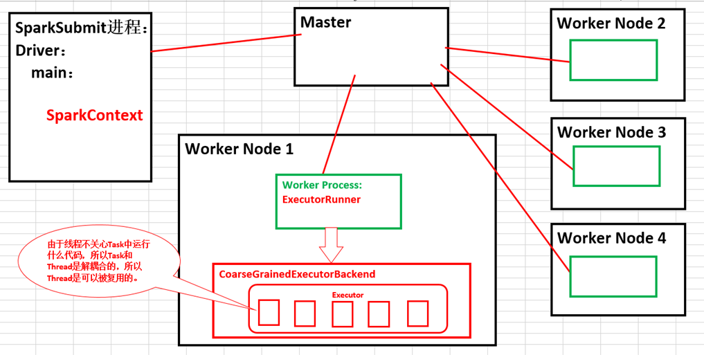

# 第21课：从Spark架构中透视Job

标签： sparkIMF

---

spark-shell中默认情况下没有任何的Job。

在Spark中我们一旦程序启动，无论说程序内部有多少作业，都是复用程序在注册时获得的资源。

**默认的资源分配方式**：在每个Worker上为当前程序分配一个ExecutorBackend进程，且默认情况下会最大化的使用Cores和Memory

在一个Executor中，一次性最多能够运行多少并发的Task取决于当前Executor能够使用的Cores的数量。

88个任务具体分配给谁，主要取决于数据本地性

并行度也是被继承的

由于线程不关心Task中运行什么代码，所以Task和Thread是解耦合的，所以Thread是可以被复用的。

##Spark内部架构图

所以我们从总体上而言：
Spark在本身集群启动的时候，有一个全局的资源管理器Master，它负责整个集群的资源的分配、管理以及接受程序提交并为程序分配计算资源。而每个节点上都有一个Worker Process来管理当前机器上的计算资源，当应用程序提交的时候，Master就会为我们的当前提交的应用程序在每个节点上默认分配一个CoarseGrainedExecutorBackend进程，这个分配的进程默认情况下如果你不做内存、CPU的限制的话，它会最大程度的运用当前机器的内存和CPU，当我们的Driver本身实例化没有问题的时候，Driver本身就会进行作业的调度来驱动我们CoarseGrainedExecutorBackend中的Executor中的线程来具体干活，这样就并发执行了。

###王家林总结：
当Spark集群启动的时候，首先启动Master进程负责整个集群资源的管理和分配并接收作业的提交且为作业分配计算资源，每个工作节点默认情况下都会启动一个Worker Process来管理当前节点的Memory、CPU等计算资源并且向Master汇报Worker还能够正常工作；当用户提交作业给Master的时候，Master会为程序分配ID并分配计算资源，默认情况下会为当前的应用程序在每个Worker Process下面分配一个CoarseGrainedExecutorBackend进程，该进程默认情况下会最大化的使用当前节点上的内存和CPU。

我们说Worker Process管理当前节点的内存和CPU等计算资源，实质上是通过Master来管理每台机器上的计算资源的！！！

Worker节点上有Worker Process，Worker Process会接受Master的指令为当前要运行的应用程序分配CoarseGrainedExecutorBackend进程

###分析

整个集群分为Master节点和Worker节点，所以它是Master-Slave的结构。Master节点本身有一个Master守护进程，它会负责管理全部的Worker节点。而Worker节点它是在工作（就是Worker Node上面的守护进程）它会负责管理Executors。

从总体上来讲：每个工作节点默认情况下都会启动一个Worker Process来管理当前节点的Memory、CPU等计算资源。

当我们提交程序连接Master的话，Master本身会给我们分配计算资源，每个Worker上可以存在一个或者多个ExecutorBackend，每个进程就是每个ExecutorBackend进程会包含一个Executor对象，而这个对象持有一个线程池，每个线程可以被复用的执行多个Task。

每个应用程序都会包含一个Driver和多个Executors。每个Executor里面它通过线程池中的线程运行Tasks，这些Tasks都属于同一个应用程序。

###Worker Process会不会管理计算资源？ 
    不会！Worker Process只是走个形式，而真正管理计算资源的还是Master。

##Job物理视图解析

Stage0是Stage1的Mapper
Stage1是Stage2的Mapper
Stage1是Stage0的Reducer
Stage2是Stage1的Reducer

Spark是一个更加精致和高效的MapReduce思想的具体实现。

最后一个Stage里面的Task是ResultTask类型，前面所有的Stage中的Task的类型都是ShuffleMapTask类型的。

Stage里面的内容一定是在Executor中执行的！而且Stage必须从前往后执行！

Spark的一个应用程序中可以因为不同的Action产生众多的Job，每个Job至少有1个Stage。

##总结
本讲课程的重要作用：巩固前面的内容，且开启下面Spark的密码之旅。
接下来8-12讲会彻底解密Spark
