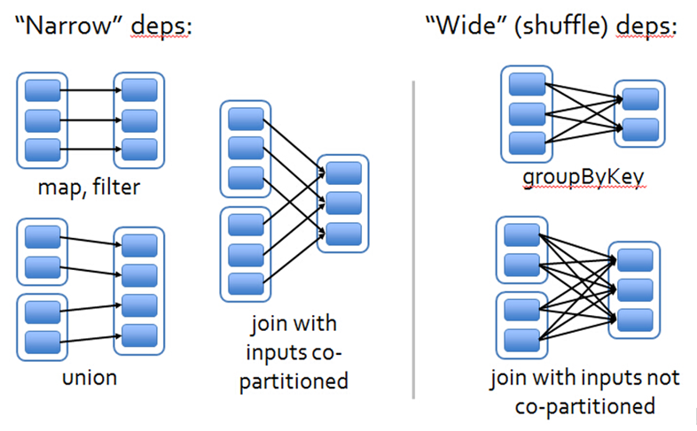
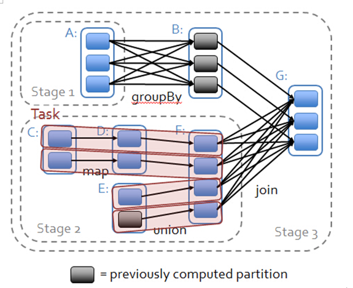
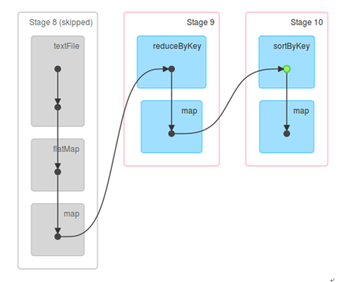

# 第22课：RDD的依赖关系彻底解密

标签（空格分隔）： sparkIMF

---

##RDD依赖关系的本质内幕

 1. 窄依赖就是指每个父RDD的一个Partition最多被子RDD的一个Partition所使用，例如map、filter、union等都会产生窄依赖。
 2. 宽依赖是指一个父RDD的Partition会被多个子RDD的Partition所使用，例如groupByKey、reduceByKey、sortByKey等操作都会产生宽依赖。

总结：如果父RDD的一个Partition被一个子RDD的Partition所使用就是窄依赖，否则的话就是宽依赖。**如果子RDD中的Partition对父RDD的Partition依赖的数量不会随着RDD数据规模的改变而改变的话，就是窄依赖，否则的话就是宽依赖。**

特别说明：对join操作有两种情况，如果说join操作的时候每个Partition仅仅和已知的Partition进行join，此时的join操作就是窄依赖；其他情况的join操作就是宽依赖。
因为是确定的Partition数量的依赖关系，所以就是窄依赖，得出一个推论：窄依赖不仅包含一对一的窄依赖，还包含一对固定个数的窄依赖（也就是说对父RDD的依赖的Partition的数量不会随着RDD数据规模的改变而改变）。

##依赖关系下的数据流视图

注意：

 1. 从后往前推理，遇到宽依赖就断开，遇到窄依赖就把当前的RDD加入到该Stage中。
 2. **每个Stage里面的Task数量是由该Stage中最后一个RDD的Partition的数量所决定的!**
 3. 最后一个Stage里面的任务的类型是ResultTask，前面其他所有的Stage里面的任务的类型都是ShuffleMapTask
 4. **代表当前Stage的算子一定是该Stage的最后一个计算步骤！！！**

补充：Hadoop中的MapReduce操作中的Mapper和Reducer在Spark中基本等量的算子是：map、reduceByKey

表面上是数据在流动，实质上是算子在流动：

 1. 数据不动代码动
 2. 在一个Stage内部算子为何会流动（Pipeline）？首先是算子合并，也就是所谓的函数式编程执行的时候最终进行函数的展开，从而把一个Stage内部的多个算子合并成为一个大算子（其内部包含了所有算子对数据的计算逻辑）；其次是由于Transformation操作的Lazy特性!!!在具体算子交给集群的Executor计算之前首先会通过Spark Framework（DAGScheduler）进行算子的优化（基于数据本地性的Pipeline）。

