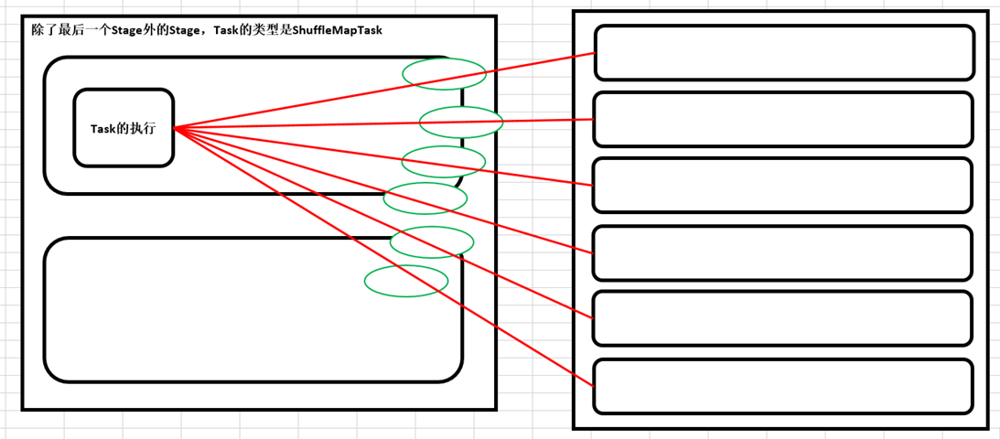

# 第24课：Spark Hash Shuffle内幕彻底解密

标签： sparkIMF

---

##一：到底什么是Shuffle？

　　Shuffle中文翻译为“洗牌”，需要Shuffle的关键性原因是某种具有共同特征的数据需要最终汇聚到一个节点上进行计算。

##二：Shuffle可能面临的问题？<font color='red'>运行Task的时候才会产生Shuffle（Shuffle已经融化在Spark的算子中了）。</font>

 1. 数据量非常大；
 2. 数据如何分类，即如何Partition，Hash、Sort、钨丝计算；
 3. 负载均衡（数据倾斜）；
 4. 网络传输效率，需要在压缩和解压缩之间做出权衡，序列化和反序列化也是要考虑的问题；

说明：具体的Task进行计算的时候尽一切最大可能使得数据具备Process Locality的特性；退而求次是增加数据分片，减少每个Task处理的数据量。

##三：Hash Shuffle

 1. Key不能是Array
 2. Hash Shuffle不需要排序，此时从理论上讲就节省了Hadoop MapReduce中进行Shuffle需要排序时候的时间浪费，因为实际生产环境下有大量的不需要排序的Shuffle类型；
 
    <font color='red'>**思考：不需要排序的Hash Shuffle是否一定比需要排序的Sorted Shuffle速度更快？
不一定！如果数据规模比较小的情况下，不需要排序的Hash Shuffle会比Sorted Shuffle速度快（快很多），但是如果数据量大，此时Sorted Shuffle一般都会比Hash Shuffle快（很多）。**</font>
 3. 每个ShuffleMapTask会根据Key的哈希值计算出当前的key需要写入的Partition，然后把决定后的结果写入到单独的文件中，此时<font color='red'>会导致每个Task产生R（指下一个Stage的并行度）个文件，如果当前的Stage中有M个ShuffleMapTask，则会产生M*R个文件！！！</font>
注意：Shuffle操作绝大多数情况下都要通过网络，如果Mapper和Reducer在同一台机器上，此时只需要读取本地磁盘即可。
Hash Shuffle的两大死穴：第一：Shuffle前会产生海量的小文件于磁盘之上，此时会产生大量耗时低效的IO操作；第二：<font color='red'>内存不够用！！！由于内存中需要保存海量的文件操作句柄和临时缓存信息，如果数据处理规模比较庞大的话，内存不可承受，出现OOM等问题！</font>



　　为了改善上述的问题（同时打开过多文件导致Writer Handler内存使用过大以及产生过多文件导致大量的随机读写带来的效率极为低下的磁盘IO操作），Spark后来推出了Consalidate机制，来把小文件合并，此时Shuffle时文件产生的数量为Cores*R，对于ShuffleMapTask的数量明显多于同时可用的并行Cores的数量的情况下，Shuffle产生的文件会大幅度减少，会极大降低OOM的可能；


　　为此Spark推出了Shuffle Pluggable开放框架，方便系统升级的时候定制Shuffle功能模块，也方便第三方系统改造人员根据实际的业务场景来开发具体最佳的Shuffle模块；核心接口ShuffleManager，具体默认实现有HashShuffleManager、SortShuffleManager等，Spark 1.6.0中具体的配置如下：

SparkEnv.scala

```scala
val shortShuffleMgrNames = Map(
      "hash" -> "org.apache.spark.shuffle.hash.HashShuffleManager",
      "sort" -> "org.apache.spark.shuffle.sort.SortShuffleManager",
      "tungsten-sort" -> "org.apache.spark.shuffle.sort.SortShuffleManager")
```

默认配置：

```scala
val shuffleMgrName = conf.get("spark.shuffle.manager", "sort")
```

SortShuffle只会产生一个文件，同时生成索引文件，极大的减少了文件的数量，但实质上而言，它在中间的处理过程中还会产生很多的文件，同时归并排序（会产生10-100个文件）。

对于SortShuffle而言，相当于有2个文件，一个是索引文件，一个是具体的内容。