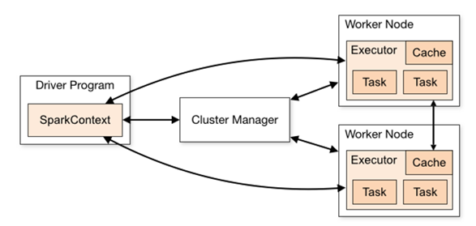
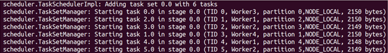

# 第26课：Spark Runtime（Driver、Masster、Worker、Executor）内幕解密

标签： sparkIMF

---


##一：再论Spark集群部署

 1. 从Spark Runtime的角度来讲由五大核心对象：Master、Worker、Executor、Driver、CoarseGrainedExecutorBackend；
 2. Spark在做分布式集群系统设计的时候：最大化功能独立、模块化封装具体独立的对象、强内聚松耦合
 
 3. 当Driver中的SparkContext初始化的时候会提交程序给Master，Master如果接受该程序在Spark中运行的话，就会为当前的程序分配AppID，同时会分配具体的计算资源，需要特别注意的是，<font color='red'>**Master是根据当前提交程序的配置信息来给集群中的Worker发指令分配具体的计算资源。但是，Master发出指令后并不关心具体的资源是否已经分配，转过来说Master是发指令后就记录了分配的资源，以后客户端再次提交其他的程序的话就不能使用该资源了。其弊端是可能会导致其他要提交的程序无法分配到本来应该可以分配到的计算资源；最重要的优势是在Spark分布式系统功能弱耦合的基础上最快的运行系统（否则如果Master要等到资源最终分配成功后才通知Driver的话，就会造成Driver阻塞，不能够最大化并行计算资源的使用率）。**</font>

　　<font color='green'>**需要补充说明的是：Spark在默认情况下由于集群中一般都只有一个Application在运行，所以Master分配资源策略的弊端就没有那么明显了！**</font>


##二：Job提交过程源码解密

 1. 一个非常重要的技巧是通过在spark-shell中运行一个Job来了解Job提交的过程，然后再用源码验证这个过程：
 
    ```scala
sc.textFile("/library/dataforSortedShuffle").flatMap(_.split(" ")).map((_,1)).reduceByKey(_+_).saveAsTextFile("/library/dataoutput2")
    ```

 2. 在Spark中所有的Action都会触发一个或至少一个Job，在上述代码中是通过saveAsTextFile来触发Job的。
 3. SparkContext在实例化的时候会构造SparkDeploySchedulerBackend、DAGScheduler、TaskSchedulerImpl、MapOutputTrackerMaster等对象，其中SparkContext在实例化的时候会构造SparkDeploySchedulerBackend负责集群计算资源的管理和调度，DAGScheduler负责高层调度（例如Job中Stage的划分、数据本地性等内容），TaskSchedulerImpl负责具体Stage内部的底层调度（例如具体每个Task的调度、Task的容错等），MapOutputTrackMaster负责Shuffle中数据输出和读取的管理。
 4. TaskSchedulerImpl内部的调度：
 
    


##三：Task的运行解密：

 1. Task是运行在Executor中，而Executor又是位于CoarseGrainedExecutorBackend中的，且CoarseGrainedExecutorBackend和Executor是一一对应的
 2. 当CoarseGrainedExecutorBackend接收到TaskSetManager发过来的LaunchTask消息后会反序列化TaskDescription，然后使用CoarseGrainedExecutorBackend中唯一的Executor来执行任务

    ```scala
case LaunchTask(data) =>
  if (executor == null) {
    logError("Received LaunchTask command but executor was null")
    System.exit(1)
  } else {
    val taskDesc = ser.deserialize[TaskDescription](data.value)
    logInfo("Got assigned task " + taskDesc.taskId)
    executor.launchTask(this, taskId = taskDesc.taskId, attemptNumber = taskDesc.attemptNumber, 
        taskDesc.name, taskDesc.serializedTask)
  }
    ```

    补充说明：LaunchTask是case class

    ```scala
// Driver to executors
case class LaunchTask(data: SerializableBuffer) extends CoarseGrainedClusterMessage
    ```