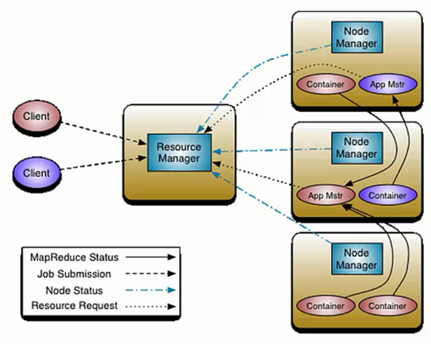

# 第27课：Spark on Yarn彻底解密

标签： sparkIMF

---

##一：Hadoop Yarn解析

 1. Yarn是Hadoop推出的整个分布式（大数据）集群的资源管理器，负责资源的管理和分配，基于Yarn我们可以在同一个大数据集群上同时运行多个计算框架，例如：Spark、MapReduce，Stom等。
 2. Yarn基本工作流程如下图所示：
    

    注意：Container要向NodeManager汇报资源信息，Container要向App Mstr汇报计算信息。
 3. 客户端Client向ResourceManager提交Application，ResourceManager接受应用并根据集群资源的状况决定在某个具体的Node上来启动当前提交的应用程序的任务调度器Driver（Applicatin Master），决定后ResourceManager会命令具体的某个Node上的资源管理器NodeManager来启动一个新的JVM进程运行程序的Driver部分，当Application Master启动的时候（会首先向ResourceManager注册来说明自己负责当前程序的运行）会下载当前Application相关的Jar等各种资源并基于此决定具体向ResourceManager申请资源的具体内容，ResourceManager接受到Application Master的资源分配的请求之后会最大化的满足资源分配的请求，并把资源的元数据信息发送给Application Master，Application Master收到资源的元数据信息后会根据元数据信息发指令给具体机器上的NodeManager，让NodeManager来启动具体的Container，Container在启动后必须向Application Master注册，当Application Master获得了用于计算的Containers后，开始进行任务的调度和计算，直到作业执行完成。
    需要补充说明的是，如果ResourceManager第一次没有能够完全完成Application Master分配资源的请求，后续ResourceManager发现集群中有新的可用资源时，会主动向Application Master发送新的可用资源的元数据信息以提供更多的资源用于当前程序的运行！

    补充说明：
    1. 如果是Hadoop的MapReduce计算的话Container不可以复用，如果是Spark on Yarn的话Container可以复用。
    2. Container具体的销毁是由Application Master来决定的。
    Application Master发指令给NodeManager让NodeManager销毁Container。

##二：Spark on Yarn的两种运行模式实战：

**此时不需要启动Spark集群，只需要启动Yarn即可！Yarn的ResourceManager就相当于Spark Standalone 模式下的Master！**

###１.Spark on Yarn的两种运行模式：唯一的决定因素是当前Application的任务调度器Driver运行在什么地方！

1. Cluster：Driver运行在Yarn集群下的某台机器上的JVM进程中！！！
2. Client：Driver运行在当前提交程序的客户机器上。

需要说明的是：无论是什么模式，只要当前机器运行了Spark代码，就必须安装Spark！

###２.Spark on Yarn的运行实战：

 1. Client模式：方便在命令终端直接看到运行的过程信息，尤其方便做测试使用
    例如：./spark-submit --class org.apache.spark.examples.SparkPi --master yarn --deploy-mode client ../lib/spark-examples-1.6.0-hadoop2.6.0.jar 50000
 
###Spark天机解密：

**Standalone模式下启动Spark集群（也就是所谓的Master和Worker）其实启动的是资源管理器，真正作业计算的时候和集群资源管理器没有任何关系，所以Spark的Job真正执行作业的时候不是运行在你启动的Spark集群中的，而是运行在一个个JVM中的，只要你在JVM所在的机器上安装配置了Spark即可！！！**

###３.Spark on Yarn模式下Driver和Application Master的关系：

 1. Cluster：Driver位于Application Master进程中，我们需要通过Hadoop默认指定的8088端口来通过Web控制台查看当前的Spark程序运行的信息，例如进度、资源的使用；
 2. Client：Driver位于提交代码的机器上，此时Application Master依旧位于集群中且只负责资源的申请和launchExecutor，此时启动后的Executor并不会向Application Master进程注册，而是向Driver注册！！！

##三：最佳实践

 1. 在Spark on Yarn的模式下 Hadoop Yarn的配置yarn.nodemanager.local-dirs会覆盖Spark的spark.local.dir!!!
 2. 在实际生产环境下一般都是采用Cluster，我们会通过History Server来获取最终全部的运行信息。
 3. 如果想直接看运行的日志信息，可以使用一下命令：
    yarn logs -applicationId <app ID>

