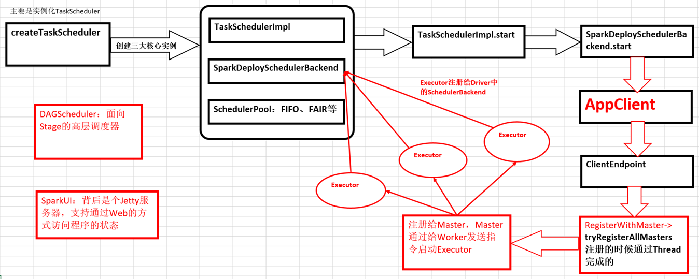

# 第28课：Spark天堂之门解密

标签： sparkIMF

---

##一：<font color='red'>Spark天堂之门：SparkContext!</font>

 1. Spark程序在运行的时候分为Driver和Executors两部分
 2. Spark的程序编写是基于SparkContext的，具体来说包含两方面：
    a) Spark编程的核心基础--RDD，是由SparkContext来最初创建（第一个RDD一定是由SparkContext来创建的）
    b) Spark程序的调度优化也是基于SparkContext；
 3. <font color='red' >Spark程序的注册是通过SparkContext实例化时候生成的对象来完成的（其实是SchedulerBackend来注册程序）；
 4. Spark程序运行的时候要通过ClusterManager获得具体的计算资源，计算资源的获取也是通过SparkContext产生的对象来申请的（其实是SchedulerBackend来获取计算资源的）；
 5. SparkContext崩溃或者结束的时候整个Spark程序也结束了！</font>

###总结：

* <font color='green'>SparkContext开启了天堂之门：Spark程序是通过SparkContext发布到Spark集群的；
* SparkContext导演了天堂世界：Spark程序的运行都是在SparkContext为核心的调度器的指挥下进行的；
* SparkContext关闭天堂之门：SparkContext崩溃或者结束的时候整个Spark程序也结束了！</font>

##二：SparkContext使用案例鉴赏


##三：SparkContext天堂内幕

 1. SparkContext构建的顶级三大核心对象：DAGScheduler、TaskScheduler、SchedulerBackend，其中：
    a) DAGScheduler是面向Job的Stage的高层调度器
    b) TaskScheduler是一个抽象接口，根据具体的Cluster Manager的不同会有不同的实现，Standalone模式下具体的实现是TaskSchedulerImpl；
    c) SchedulerBackend是一个接口，根据具体的Cluster Manager的不同会有不同的实现，Standalone模式下具体的实现是SparkDeploySchedulerBackend；
 2. 从整个程序运行的角度来讲，SparkContext包含四大核心对象；DAGScheduler、TaskScheduler、SchedulerBackend、MapOutputTrackerMaster

```scala
// Create and start the scheduler
val (sched, ts) = SparkContext.createTaskScheduler(this, master)
_schedulerBackend = sched
_taskScheduler = ts
_dagScheduler = new DAGScheduler(this)
_heartbeatReceiver.ask[Boolean](TaskSchedulerIsSet)

// start TaskScheduler after taskScheduler sets DAGScheduler reference in DAGScheduler's
// constructor
_taskScheduler.start()
```

createTaskScheduler：

```scala
case SPARK_REGEX(sparkUrl) =>
  val scheduler = new TaskSchedulerImpl(sc)
  val masterUrls = sparkUrl.split(",").map("spark://" + _)
  val backend = new SparkDeploySchedulerBackend(scheduler, sc, masterUrls)
  scheduler.initialize(backend)
  (backend, scheduler)
```

在sheduler.initialize调用的时候会创建SchedulerPool

```scala
def initialize(backend: SchedulerBackend) {
    this.backend = backend
    // temporarily set rootPool name to empty
    rootPool = new Pool("", schedulingMode, 0, 0)
    schedulableBuilder = {
      schedulingMode match {
        case SchedulingMode.FIFO =>
          new FIFOSchedulableBuilder(rootPool)
        case SchedulingMode.FAIR =>
          new FairSchedulableBuilder(rootPool, conf)
      }
    }
    schedulableBuilder.buildPools()
  }
```

SparkDeploySchedulerBackend有三大核心功能：

 1. <font color='red'>负责与Master连接注册当前程序；
 2. 接收集群中为当前应用程序而分配的计算资源Executor的注册并管理Executors
 3. 负责发送Task到具体的Executor执行</font>

补充说明的是：SparkDeploySchedulerBackend是被TaskSchedulerImpl来管理的！
 
```scala
 // start TaskScheduler after taskScheduler sets DAGScheduler reference in DAGScheduler's
// constructor
_taskScheduler.start()
```
 
```scala
 val command = Command("org.apache.spark.executor.CoarseGrainedExecutorBackend",
  args, sc.executorEnvs, classPathEntries ++ testingClassPath, libraryPathEntries, javaOpts)
```
 
　　<font color='red'>当通过SparkDeploySchedulerBackend注册程序给Master的时候会把上述command提交给Master，Master发指令给Worker去启动Executor所在的进程的时候加载的main方法所在的入口类就是就是command中的CoarseGrainedExecutorBackend，当然你可以实现自己的ExecutorBackend。在CoarseGrainedExecutorBackend中启动Executor（Executor是先注册再实例化），Executor通过线程池并发执行Task。</font>
　　
```scala
private[spark] case class ApplicationDescription(
    name: String,
    maxCores: Option[Int],
    memoryPerExecutorMB: Int,
    command: Command,
    appUiUrl: String,
    eventLogDir: Option[URI] = None,
    // short name of compression codec used when writing event logs, if any (e.g. lzf)
    eventLogCodec: Option[String] = None,
    coresPerExecutor: Option[Int] = None,
    user: String = System.getProperty("user.name", "<unknown>")) {

  override def toString: String = "ApplicationDescription(" + name + ")"
}
```
 
##SparkContext内幕解密


