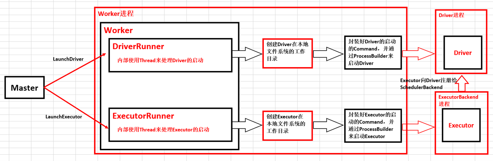

# 第32课：Spark Worker原理和源码剖析解密：Worker工作流程图、Worker启动Driver源码解密、Worker启动Executor源码解密等

标签： sparkIMF

---

Worker本身一个核心的作用就是管理当前机器的内存、CPU等资源，它真正的工作本身是接受Master的指令来启动Driver或者说来启动Executor。所以我们如果说真正的想关注Worker到底是怎么回事，你肯定是把重点放到它如何启动Driver和如何启动Executor。当然在Driver工作或Executor工作的过程中，它可能例如说Driver挂掉了或Executor挂掉了，它有一些处理的机制。如果说真正的处理不了了，这个时候Worker就要向Master进行沟通，说Executor或Driver挂掉了，而Master作为整个集群的资源调度器，它就可以通过schedule再次的调度资源。

##一：Worker原理内幕和流程机制

##二：Worker启动内幕

 1. Cluster中的Driver失败的时候，如果supervise为true，则启动该Driver的Worker会负责重新启动该Driver。
 2. DriverRunner启动进程是通过ProcessBuilder中的process.get.waitFor来完成的。

