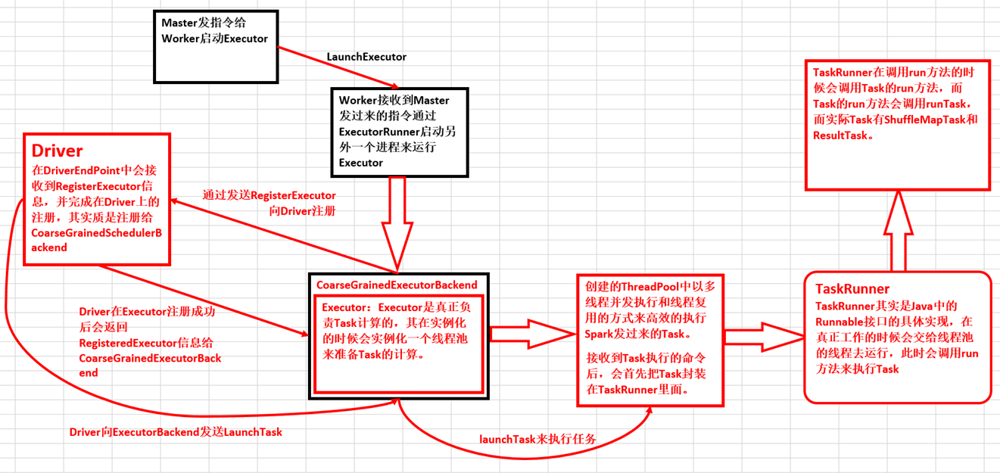

# 第33课：Spark Executor内幕彻底解密：Executor工作原理图、ExecutorBackend注册源码解密、Executor实例化内幕、Executor具体工作内幕

标签： sparkIMF

---


##为什么Worker要新开一个进程来启动Executor进行计算？

从任何一个角度讲，它必须启动一个进程：

 1. Worker是管理当前机器上的资源的，而且当前机器上的资源变动的时候要汇报给我们的Master，Worker不是用来计算的，你不能在Worker里面做计算。
 2. 我们Spark集群中有很多应用程序，而又很多应用程序，你就需要有很多Executor，如果你不是为每一个Executor启动一个进程，而是让这些所有的Executor都在Worker里面，那岂不是一个程序崩溃了，导致其他程序也崩溃了！

##一：Spark Executor工作原理

 1. 需要特别注意的是在CoarseGrainedExecutorBackend启动时向Driver注册Executor，其实质是注册ExecutorBackend实例，和Executor实例之间没有直接的关系！！！
 2. CoarseGrainedExecutorBackend是Executor运行所在的进程名称，Executor才是正在处理Task的对象，Executor内部是通过线程池的方式来完成Task的计算的。
 3. CoarseGrainedExecutorBackend和Executor是一一对应的。
 4. CoarseGrainedExecutorBackend是一个消息通信体（其实现了ThreadSafeRPCEndPoint），可以发送信息给Driver并可以接受Driver中发过来的指令，例如启动Task等。
 5. 在Driver进程中有两个至关重要的EndPoint
    a) ClientEndpoint：主要负责向Master注册当前的程序，是AppClient的内部成员。
    b) DriverEndpoint：这是整个程序运行时候的驱动器，是CoarseGrainedExecutorBackend的内部成员！
 6. 在Driver中通过ExecutorData封装并注册ExecutorBackend的信息到Driver内存数据结构executorMapData中。
    ```scala
    private[cluster] class ExecutorData(
      val executorEndpoint: RpcEndpointRef,
      val executorAddress: RpcAddress,
      override val executorHost: String,
      var freeCores: Int,
      override val totalCores: Int,
      override val logUrlMap: Map[String, String]
    ) extends ExecutorInfo(executorHost, totalCores, logUrlMap)
    ```
    
 7. 实际在执行的时候DriverEndpoint会把信息写入CoarseGrainedSchedulerBackend的内存结构executorDataMap，所以说最终是注册给了CoarseGrainedExecutorBackend，也就是说CoarseGrainedExecutorBackend掌握了为当前程序分配的所有的ExecutorBackend进程，而在每一个ExecutorBackend进程实例中会通过Executor对象来负责具体Task的运行。在运行的时候使用synchronized关键字来保证executorDataMap安全的并发写操作。
 8. CoarseGrainedExecutorBackend收到DriverEndpoint发送过来的RegisterExecutor消息后会启动Executor实例对象，而Executor实例对象是事实上负责真正Task计算的。


executorDataMap是CoarseGrainedSchedulerBackend的成员



CoarseGrainedExecutorBackend是Executor运行所在的进程的名称。CoarseGrainedExecutorBackend本身并不会完成具体任务的计算，完成计算的是Executor！

##二：Executor具体是如何工作的？

 1. 当Driver发送过来Task的时候，其实是发送给了CoraseGrainedExecutorBackend这个RPCEndpoint，而不是直接发送给了Executor（Executor由于不是消息循环体，所以永远也无法直接接受远程发过来的信息）。
    ```scala
    case LaunchTask(data) =>
      if (executor == null) {
        logError("Received LaunchTask command but executor was null")
        System.exit(1)
      } else {
        val taskDesc = ser.deserialize[TaskDescription](data.value)
        logInfo("Got assigned task " + taskDesc.taskId)
        executor.launchTask(this, taskId = taskDesc.taskId, attemptNumber = taskDesc.attemptNumber,
          taskDesc.name, taskDesc.serializedTask)
      }
    ```
    
 2. ExecutorBackend在收到Driver中发送过来的消息后会通过调用launchTask来交给Executor去执行；
    ```scala
    case LaunchTask(data) =>
      if (executor == null) {
        logError("Received LaunchTask command but executor was null")
        System.exit(1)
      } else {
        val taskDesc = ser.deserialize[TaskDescription](data.value)
        logInfo("Got assigned task " + taskDesc.taskId)
        executor.launchTask(this, taskId = taskDesc.taskId, attemptNumber = taskDesc.attemptNumber,
          taskDesc.name, taskDesc.serializedTask)
      }
    ```
    

 

##要向成为Spark高手的话，必须同时掌握Java和Scala！
