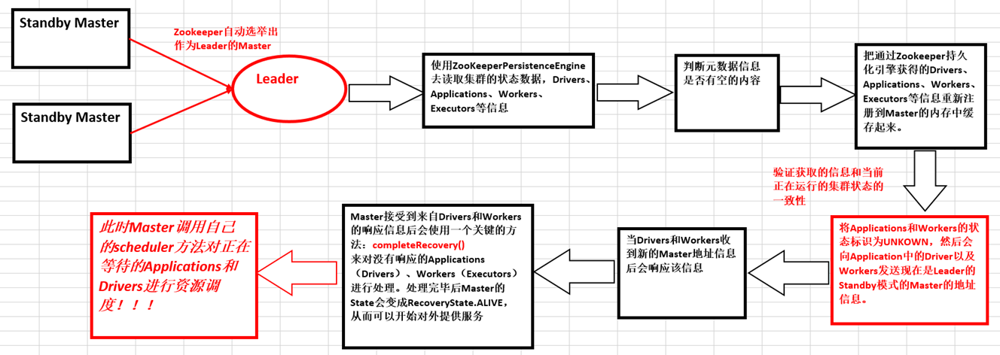

# 第29课：Master HA彻底解密

标签： sparkIMF

---

##一：Master HA解析

 1. 生产环境下一般采用Zookeeper做HA，且建议为3台Master，Zookeeper会自动化管理Masters的切换；
 2. 采用Zookeeper做HA的时候，Zookeeper会负责保存整个Spark集群运行时候的元数据：Workers、Drivers、Applications、Executors
 3. Zookeeper遇到当前Active级别的Master出现故障的时候会从Standby Masters中选取出一台作为Active Master，但是要注意，被选举后到成为真正的Active Master之间需要从Zookeeper中获取集群当前运行状态的元数据信息并进行恢复。
 4. <font color='red'>在Master切换的过程中，所有的已经在运行的程序皆正常运行！因为Spark Application在运行前就已经通过Cluster Manager获得了计算资源。所以在运行时Job本身的调度和处理和Master是没有任何关系的！
 5. 在Master的切换过程中唯一的影响是不能提交新的Job：一方面不能够提交新的应用程序给集群，因为只有Active Master才能接受新的程序的提交请求；另外一方面，已经运行的程序中也不能够因为Action操作触发新的Job的提交请求；</font>

##Master HA的四大方式

 1. Master HA的四大方式分别是：ZOOKEEPER、FILESYSTEM、CUSTOM、NONE；
 2. 需要说明的是：
    a) Zookeeper是自动管理Master
    b) FileSystem的方式在Master出现故障后需要手动重新启动机器，机器启动后会立即成为Active级别的Master来对外提供服务（接受应用程序提交的请求、接受新的Job运行的请求）
    c) Custom的方式允许用户自定义Master HA的实现，这对于高级用户特别有用；
    d) NONE，这是默认情况，当我们下载安装了Spark集群后就是采用这种方式，该方式不会持久化集群的数据。Master启动后立即管理集群。
 3. Master.onStart方法解析

    ```scala
val serializer = new JavaSerializer(conf)
val (persistenceEngine_, leaderElectionAgent_) = RECOVERY_MODE match {
  case "ZOOKEEPER" =>
    logInfo("Persisting recovery state to ZooKeeper")
    val zkFactory =
      new ZooKeeperRecoveryModeFactory(conf, serializer)
    (zkFactory.createPersistenceEngine(), zkFactory.createLeaderElectionAgent(this))
  case "FILESYSTEM" =>
    val fsFactory =
      new FileSystemRecoveryModeFactory(conf, serializer)
    (fsFactory.createPersistenceEngine(), fsFactory.createLeaderElectionAgent(this))
  case "CUSTOM" =>
    val clazz = Utils.classForName(conf.get("spark.deploy.recoveryMode.factory"))
    val factory = clazz.getConstructor(classOf[SparkConf], classOf[Serializer])
      .newInstance(conf, serializer)
      .asInstanceOf[StandaloneRecoveryModeFactory]
    (factory.createPersistenceEngine(), factory.createLeaderElectionAgent(this))
  case _ =>
    (new BlackHolePersistenceEngine(), new MonarchyLeaderAgent(this))
}
    ```
 4. PersistenceEngine中有一个至关重要的方法persist来实现数据持久化，readPersistedData来恢复集群中的元数据；
    ```scala
 /**
   * Defines how the object is serialized and persisted. Implementation will
   * depend on the store used.
   */
  def persist(name: String, obj: Object)
  
  /**
   * Returns the persisted data sorted by their respective ids (which implies that they're
   * sorted by time of creation).
   */
  final def readPersistedData(
      rpcEnv: RpcEnv): (Seq[ApplicationInfo], Seq[DriverInfo], Seq[WorkerInfo]) = {
    rpcEnv.deserialize { () =>
      (read[ApplicationInfo]("app_"), read[DriverInfo]("driver_"), read[WorkerInfo]("worker_"))
    }
  }
    ```
 5. FileSystem和NONE的方式均是采用MonarchyElectionAgent的方式来完成Leader选举，其实际实现是直接将传入的Master设置为Leader；

##Master HA的内部工作机制



Master接受到来自Drivers和Workers的响应信息后会使用一个关键的方法：completeRecovery()
来对没有响应的Applications（Drivers）、Workers（Executors）进行处理：

```scala
// Kill off any workers and apps that didn't respond to us.
    workers.filter(_.state == WorkerState.UNKNOWN).foreach(removeWorker)
    apps.filter(_.state == ApplicationState.UNKNOWN).foreach(finishApplication)
```