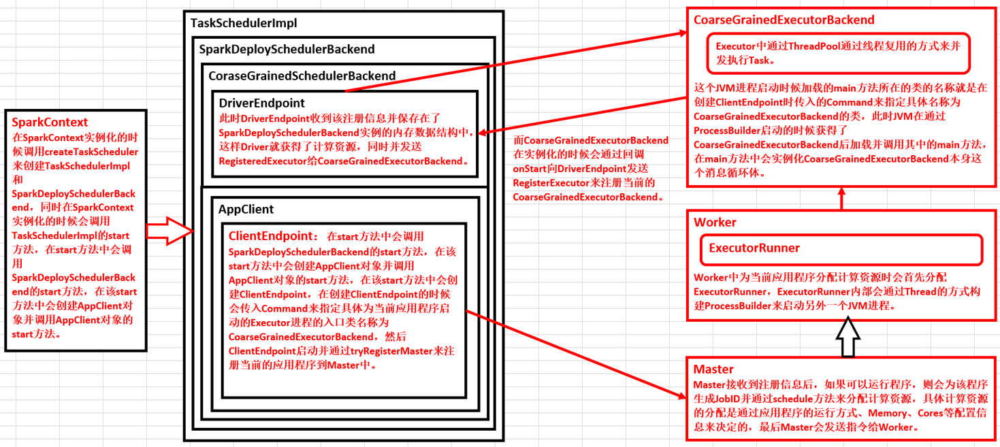

# 第35课：打通Spark系统运行内幕机制循环流程

标签： sparkIMF

---

##一：TaskScheduler原理揭秘

 1. DAGScheduler在提交TaskSet给底层调度器的时候是面向接口TaskScheduler的，这符合面向对象中依赖抽象而不依赖具体的原则，带来了底层资源调度器的可插拔性，导致Spark可以运行在众多的资源调度器模式上，例如Standalonee、Yarn、Mesos、Local、EC2、其他自定义的资源调度器。在Standalone的模式下我们聚焦于TaskSchedulerImpl。
 2. 在SparkContext实例化的时候通过createTaskScheduler来创建TaskSchedulerImpl和SparkDeploySchedulerBackend：
    ```scala
    case SPARK_REGEX(sparkUrl) =>
        val scheduler = new TaskSchedulerImpl(sc)
        val masterUrls = sparkUrl.split(",").map("spark://" + _)
        val backend = new SparkDeploySchedulerBackend(scheduler, sc, masterUrls)
        scheduler.initialize(backend)
        (backend, scheduler)
    ```
    
    在TaskSchedulerImpl的initialize方法中把SparkDeploySchedulerBackend传进来从而赋值为TaskSchedulerImpl的backend。在TaskSchedulerImpl调用start方法的时候会调用backend.start方法，在start方法中会最终注册应用程序。
 3. TaskScheduler的核心任务是提交TaskSet到集群运算并汇报结果
    * 为TaskSet创建和维护一个TaskSetManager并追踪任务的本地性以及错误信息
    * 遇到Straggle任务会放到其他的节点进行重试
    * 向DAGScheduler汇报执行情况，包括在Shuffle输出lost的时候报告fetch field错误等信息。
 4. TaskScheduler内部握有SchedulerBackend，从Standalone的模式来讲具体实现是SparkDeploySchedulerBackend。
 5. SparkDeploySchedulerBackend在启动的时候构造了AppClient实例，并在该实例start的时候启动了ClientEndpoint这个消息循环体，ClientEndpoint在启动的时候会向Master注册当前程序。而SparkDeploySchedulerBackend的父类CoarseGrainedSchedulerBackend在start的时候会实例化类型为DriverEndpoint（这就是我们程序运行时候的经典的对象Driver）的消息循环体。SparkDeploySchedulerBackend专门负责收集Worker上的资源信息，当ExecutorBackend启动的时候会发送RegisteredExecutor信息向DriverEndpoint注册，此时SparkDeploySchedulerBackend就掌握了当前应用程序拥有的计算资源，TaskScheduler就是通过SparkDeploySchedulerBackend拥有的计算资源来具体运行Task。
 6. SparkContext、DAGScheduler、TaskScheduleImpl、SparkDeploySchedulerBackend在应用程序启动的时候只实例化一次，应用程序存在期间始终存在这些对象。

##大总结

<font color='red'>**在SparkContext实例化的时候调用createTaskScheduler来创建TaskSchedulerImpl和SparkDeploySchedulerBackend，同时在SparkContext实例化的时候会调用TaskSchedulerImpl的start方法。在start方法中会调用SparkDeploySchedulerBackend的start方法，在该start方法中会创建AppClient对象并调用AppClient对象的start方法，在该start方法中会创建ClientEndpoint，在创建ClientEndpoint的时候会传入Command来指定具体为当前应用程序启动的Executor进程的入口类名称为CoarseGrainedExecutorBackend，然后ClientEndpoint启动并通过tryRegisterMaster来注册当前的应用程序到Master中。Master接收到注册信息后，如果可以运行程序，则会为该程序生成JobID并通过schedule方法来分配计算资源，具体计算资源的分配是通过应用程序的运行方式、Memory、Cores等配置信息来决定的，最后Master会发送指令给Worker。Worker中为当前应用程序分配计算资源时会首先分配ExecutorRunner，ExecutorRunner内部会通过Thread的方式构建ProcessBuilder来启动另外一个JVM进程。这个JVM进程启动时候加载的main方法所在的类的名称就是在创建ClientEndpoint时传入的Command来指定具体名称为CoarseGrainedExecutorBackend的类，此时JVM在通过ProcessBuilder启动的时候获得了CoarseGrainedExecutorBackend后加载并调用其中的main方法，在main方法中会实例化CoarseGrainedExecutorBackend本身这个消息循环体。而CoarseGrainedExecutorBackend在实例化的时候会通过回调onStart向DriverEndpoint发送RegisterExecutor来注册当前的CoarseGrainedExecutorBackend。此时DriverEndpoint收到该注册信息并保存在了SparkDeploySchedulerBackend实例的内存数据结构中，这样Driver就获得了计算资源！**</font>

##打通Spark系统运行内幕机制流程循环图


