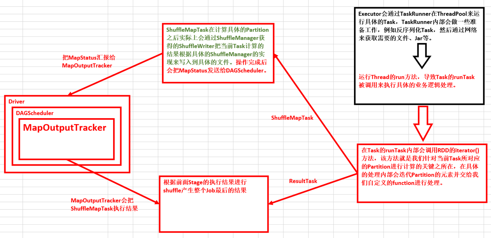

# 第37课（必须掌握）：Task执行内幕与结果处理解密

标签： sparkIMF

---

##Task执行及结果处理原理流程图和源码解密：



 1. 当Driver中的CoarseGrainedSchedulerBackend给CoarseGrainedExecutorBackend发送LaunchTask之后，CoarseGrainedExecutorBackend在收到LaunchTask消息后，首先会反序列化TaskDescription：
    ```scala
    val taskDesc = ser.deserialize[TaskDescription](data.value)
    ```
    
 2. Executor会通过launchTask来执行Task：
    ```scala
    executor.launchTask(this, taskId = taskDesc.taskId, attemptNumber = taskDesc.attemptNumber,
          taskDesc.name, taskDesc.serializedTask)
    ```
    
 3. TaskRunner在ThreadPool来运行具体的Task，在TaskRunner的run方法中首先会通过调用statusUpdate给Driver发信息汇报自己的状态说明自己是Running状态。
    ```scala
    execBackend.statusUpdate(taskId, TaskState.RUNNING, EMPTY_BYTE_BUFFER)
    ```
    
 4. TaskRunner内部会做一些准备工作，例如反序列化Task的依赖。
    ```scala
    val (taskFiles, taskJars, taskBytes) = Task.deserializeWithDependencies(serializedTask)
    ```
    然后通过网络来获取需要的文件、Jar等。
    ```scala
    updateDependencies(taskFiles, taskJars)
    ```
    
 5. 然后是反序列化Task本身。
    ```scala
    task = ser.deserialize[Task[Any]](taskBytes, Thread.currentThread.getContextClassLoader)
        task.setTaskMemoryManager(taskMemoryManager)
    ```
    
 6. 调用反序列化后的Task.run方法来执行任务并获得执行结果：
    ```scala
    val (value, accumUpdates) = try {
      val res = task.run(
        taskAttemptId = taskId,
        attemptNumber = attemptNumber,
        metricsSystem = env.metricsSystem)
      threwException = false
      res
    ```
    其中Task的run方法调用的时候会导致Task的抽象方法runTask的调用，在Task的runTask内部会调用RDD的iterator()方法，该方法就是我们针对当前Task所对应的Partition进行计算的关键之所在，在具体的处理内部会迭代Partition的元素并交给我们自定义的function进行处理。
    对于ShuffleMapTask，首先要对RDD以及其依赖关系进行反序列化：
    ```scala
    val (rdd, dep) = ser.deserialize[(RDD[_], ShuffleDependency[_, _, _])](
      ByteBuffer.wrap(taskBinary.value), Thread.currentThread.getContextClassLoader)
    ```
    最终计算会调用RDD的compute方法：
    ```scala
    def compute(split: Partition, context: TaskContext): Iterator[T]
    ```
    具体计算的时候有具体的RDD，例如MapPartitionsRDD的compute：
    ```scala
    override def compute(split: Partition, context: TaskContext): Iterator[U] =
    f(context, split.index, firstParent[T].iterator(split, context))
    ```
    其中的f就是我们在当前的Stage中计算具体Partition的业务逻辑代码。
    对于ResultTask：
    ```scala
    val (rdd, func) = ser.deserialize[(RDD[T], (TaskContext, Iterator[T]) => U)](
      ByteBuffer.wrap(taskBinary.value), Thread.currentThread.getContextClassLoader)
    _executorDeserializeTime = System.currentTimeMillis() - deserializeStartTime

    metrics = Some(context.taskMetrics)
    func(context, rdd.iterator(partition, context))
    ```
    
 7. 把执行结果序列化：
    ```scala
    val valueBytes = resultSer.serialize(value)
    ```
    并根据大小判断不同的结果传回给Driver的方式。
 8. CoarseGrainedExecutorBackend给DriverEndpoint发送StatusUpdate来传输执行结果，DriverEndpoint会把执行结果传递给TaskSchedulerImpl处理，然后交给TaskResultGetter内部通过线程去分别处理Task执行成功和失败时候的不同情况，然后告诉DAGScheduler任务处理结束的状况。
    ```scala
    
    ```

##补充说明：

 1. 在执行具体Task的业务逻辑前会进行三次反序列化：
    * TaskDescription的反序列化；
    * 反序列化Task的依赖；
    * Task的反序列化；
    * RDD反序列化；
 2. 在Spark 1.6中AkkaFrameSize是128MB，所以可以广播非常大的任务，而任务的执行结果可以最大达到1GB。

