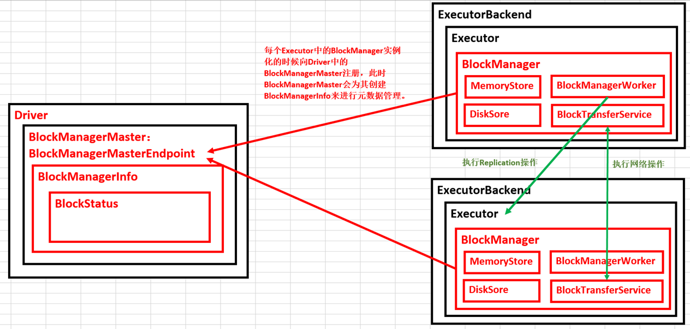

# 第38课：BlockManager架构原理、运行流程图和源码解密

标签： sparkIMF

---

##一：BlockManager运行实例观察

###<font color='red'>**从Application启动的角度来观察BlockManager**</font>

 1. 在Application启动的时候会在SparkEnv中注册BlockManagerMaster以及MapOutputTracker，其中
    * BlockManagerMaster：对整个集群的Block数据进行管理的；
    * MapOutputTrackerMaster：跟踪所有的Mapper的输出的；
 2. BlockManagerMasterEndpoint本身是一个消息体，会负责通过远程消息通信的方式管理所有节点的BlockManager。
 3. 每启动一个ExecutorBackend都会实例化BlockManager并通过远程通信的方式注册给BlockManagerMaster。实质上是Executor中的BlockManager在启动的时候注册给了Driver上的BlockManagerMasterEndpoint。
 4. MemoryStore是BlockManager中专门负责内存数据结构存储和读写的类。
 5. DiskStore是BlockManager中专门负责基于磁盘的数据存储和读写的类。
 6. DiskBlockManager：管理Logical Block与Disk上的 Physical Block之间的映射关系并负责磁盘的文件的创建、读写等。

###<font color='red'>**从Job运行的角度来观察BlockManager**</font>

 1. 首先通过MemoryStore来存储广播变量；
 2. 在Driver中是通过BlockManagerInfo来管理集群中每个ExecutorBackend中的BlockManager中的元数据信息的；
 3. 当改变了具体的ExecutorBackend上的Block信息后就必须发消息给Driver中的BlockManagerMaster来更新相应的BlockManagerInfo的信息；
 4. 当执行第二个Stage的时候，第二个Stage会向Driver中的MapOutputTrackerMasterEndpoint发消息请求上一个Stage中相应的输出，此时MapOutputTrackerMaster会把上一个Stage的输出数据的元数据信息发送给当前请求的Stage：

```text
16/02/14 20:47:15 INFO spark.MapOutputTrackerMasterEndpoint: Asked to send map output locations for shuffle 0 to Worker3:45965
16/02/14 20:47:15 INFO spark.MapOutputTrackerMaster: Size of output statuses for shuffle 0 is 218 bytes
16/02/14 20:47:15 INFO storage.BlockManagerInfo: Added broadcast_2_piece0 in memory on Worker4:46458 (size: 22.6 KB, free: 2.7 GB)
16/02/14 20:47:15 INFO spark.MapOutputTrackerMasterEndpoint: Asked to send map output locations for shuffle 0 to Worker4:57697
```

##BlockManager工作原理和运行机制简图



###王家林：
我们现在分享的是Spark的本质和真相；
欠了内核的东西迟早要还的；
