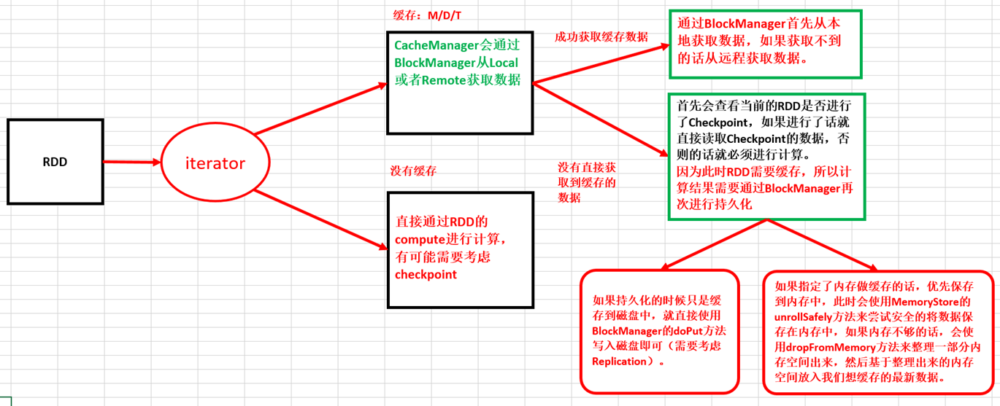

# 第40课：CacheManager彻底解密：CacheManager运行原理流程图和源码详解

标签： sparkIMF

---

##一：CacheManager分析

 1. CacheManager管理的缓存，而缓存可以是基于内存的缓存，也可以是基于磁盘的缓存；
 2. CacheManager需要通过BlockManager来操作数据；
 3. 每当Task运行的时候会调用RDD的compute方法进行计算，而compute方法会调用iterator方法：
```scala
/**
 * Internal method to this RDD; will read from cache if applicable, or otherwise compute it.
 * This should ''not'' be called by users directly, but is available for implementors of custom
 * subclasses of RDD.
 */
final def iterator(split: Partition, context: TaskContext): Iterator[T] = {
  if (storageLevel != StorageLevel.NONE) {
    SparkEnv.get.cacheManager.getOrCompute(this, split, context, storageLevel)
  } else {
    computeOrReadCheckpoint(split, context)
  }
}
```

##二：CacheManager源码详解

 1. Cache在工作的时候会最大化的保留数据，但是数据不一定绝对完整，因为当前的计算如果需要内存空间的话，那么Cache在内存中的数据必须让出空间，此时如果在RDD持久化的时候同时指定了可以把数据放在Disk上，那么部分Cache的数据就可以从内存转入磁盘，否则的话，数据就会丢失！！！
 2. 具体CacheManager在获得缓存数据的时候会通过BlockManager来抓到数据：
    ```scala
    /**
   * Get a block from the block manager (either local or remote).
   */
  def get(blockId: BlockId): Option[BlockResult] = {
    val local = getLocal(blockId)
    if (local.isDefined) {
      logInfo(s"Found block $blockId locally")
      return local
    }
    val remote = getRemote(blockId)
    if (remote.isDefined) {
      logInfo(s"Found block $blockId remotely")
      return remote
    }
    None
  }
    ```
    
 3. 如果CacheManager没有通过BlockManager获得缓存内容的话，此时会通过RDD的如下方法来获得数据：
    ```scala
    val computedValues = rdd.computeOrReadCheckpoint(partition, context)
    ```
    上述方法首先会查看当前的RDD是否进行了Checkpoint，如果进行了话就直接读取Checkpoint的数据，否则的话就必须进行计算：计算之后通过putInBlockManager会把数据按照StorageLevel重新缓存起来；

 4. 计算之后通过putInBlockManager会把数据按照StorageLevel重新缓存的时候如果需要放在内存中，
 
##CacheManager内幕解密


