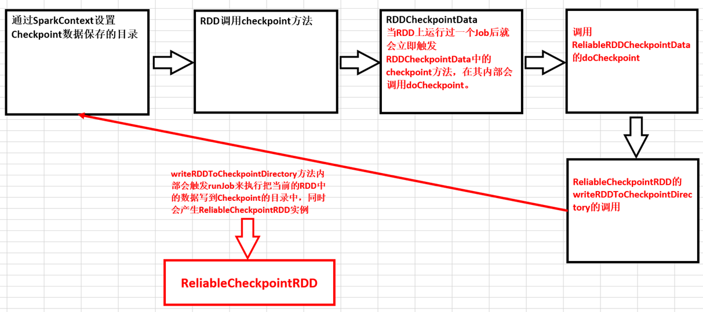

#第41课：Checkpoint彻底解密：Checkpoint的运行原理和源码实现彻底详解

标签： sparkIMF

---

##一：Checkpoing到底是什么？

 1. Spark在生产环境下经常会面临Transformations的RDD非常多（例如一个Job中包含1万个RDD）或者具体Transformation产生的RDD本身计算特别复杂和耗时（例如计算时长超过1个小时），此时我们必须考虑对计算结果数据的持久化；
 2. Spark是擅长多步骤迭代，同时擅长基于Job的复用，这个时候如果能够对曾经计算的过程产生的数据进行复用，就可以极大的提升效率；
 3. 如果采用persist把数据放在内存中的话，虽然是最快速的但是也是最不可靠的；如果放在磁盘上也不是完全可靠的！例如磁盘会损坏，<font color='red'>管理员可能清空磁盘</font>。
 4. Checkpoint的产生就是为了相对而言更加可靠的持久化数据，在Checkpoint可以指定把数据放在本地并且是多副本的方式，但是在正常的生产环境下是放在HDFS上，这就天然的借助了HDFS高容错的高可靠的特征来完成了最大化的可靠的持久化数据的方式；
 5. Checkpoint是为了最大程度保证绝对可靠的复用RDD计算数据的Spark的高级功能，通过Checkpoint我们通常把数据持久化到HDFS来保证数据的最大程度的安全性；
 6. Checkpoint就是针对整个RDD计算链条中特别需要数据持久化的环节（后面会反复使用当前环节的RDD）开启基于HDFS等的数据持久化复用策略，通过对RDD启动checkpoint机制来实现容错和高可用。

##二：Checkpoint原理机制

 1. 通过调用SparkContext.setCheckpointDir方法来指定进行Checkpoint操作的RDD把数据放在哪里，在生产集群中是放在HDFS上的，同时为了提高效率在进行Checkpoint的时候可以指定很多目录；
    ```scala
    /**
     * Set the directory under which RDDs are going to be checkpointed. The directory must
     * be a HDFS path if running on a cluster.
     */
    def setCheckpointDir(directory: String) {
  
      // If we are running on a cluster, log a warning if the directory is local.
      // Otherwise, the driver may attempt to reconstruct the checkpointed RDD from
      // its own local file system, which is incorrect because the checkpoint files
      // are actually on the executor machines.
      if (!isLocal && Utils.nonLocalPaths(directory).isEmpty) {
        logWarning("Checkpoint directory must be non-local " +
          "if Spark is running on a cluster: " + directory)
      }
  
      checkpointDir = Option(directory).map { dir =>
        val path = new Path(dir, UUID.randomUUID().toString)
        val fs = path.getFileSystem(hadoopConfiguration)
        fs.mkdirs(path)
        fs.getFileStatus(path).getPath.toString
      }
    }
    ```
    
 2. 在进行RDD的checkpoint的时候其所依赖的所有的RDD都会从计算链条中清空掉；
 3. <font color='red'>**作为最佳实践，一般在进行checkpoint方法调用前通常都要进行persist来把当前RDD的数据持久化到内存或者磁盘上，这是因为checkpoint是Lazy级别的，必须有Job的执行且在Job执行完成后才会从后往前回溯哪个RDD进行了Checkpoint标记，然后对该标记了要进行Checkpoint的RDD新启动一个Job执行具体的Checkpoint的过程；**</font>
 4. Checkpoint改变了RDD的Lineage；
 5. 当我们调用了checkpoint方法要对RDD进行Checkpoint操作的话，此时框架会自动生成RDDCheckpointData，当RDD上运行过一个Job后就会立即触发RDDCheckpointData中的checkpoint方法，在其内部会调用doCheckpoint。实际上在生产环境下会调用ReliableRDDCheckpointData的doCheckpoint方法。在生产环境下会导致ReliableCheckpointRDD的writeRDDToCheckpointDirectory的调用，而在writeRDDToCheckpointDirectory方法内部会触发runJob来执行把当前的RDD中的数据写到Checkpoint的目录中，同时会产生ReliableCheckpointRDD实例；

##Checkpoint运行流程图


