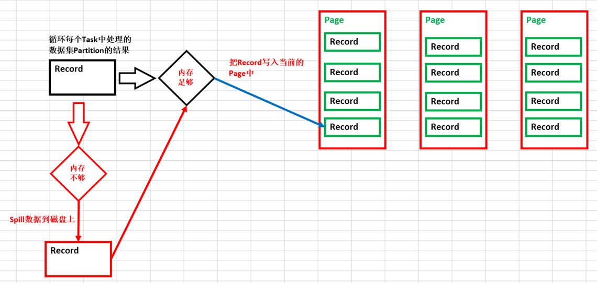

# 第52课：王家林谈Spark性能优化第八季之Spark Tungsten-sort Based Shuffle 内幕解密

标签： sparkIMF

---

##一：使用Tungsten功能

 1. 如果想让你程序使用Tungsten的功能，可以配置：
    spark.shuffle.manager=tungsten-sort
 2. DataFrame中自动开启了Tungsten功能

##二：Tungsten-sort base shuffle writer内幕

 1. 写数据在内存足够大的情况下是写到Page里面，在Page中有一条条的Record，如果内存不够的话会Spill到磁盘上；
 2. 如何看内存是否足够呢？两方面：
    * 系统默认情况下给ShuffleMapTask最大准备了多少内存空间，默认情况下是 
    ExecutorHeapMemory * 0.8 * 0.2
    spark.shuffle.memoryFraction=0.2
    spark.shuffle.safetyFraction=0.8
    * 另外一方面是和Task处理的Partition大小紧密相关；
 3. 在Tungsten下获取数据的类叫做BlockStoreShuffleReader，其底层其实是Page；

##Tungsten sort-based Shuffle写数据的过程

