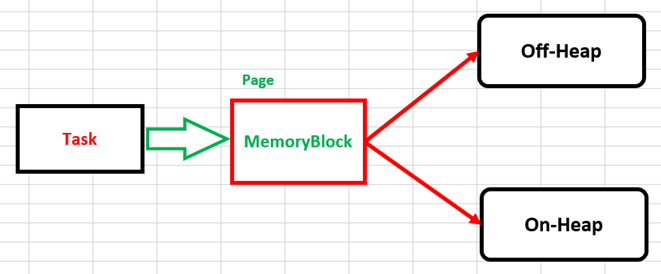
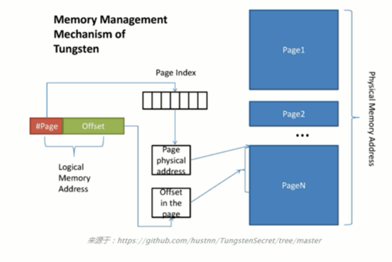

# 第53课：王家林谈Spark性能优化第九季之Spark Tungsten内存使用彻底解密

标签： sparkIMF

---

##一：Tungsten中到底什么是Page

 1. 在Spark中其实是不存在Page这个类的！实质上来说，Page是一种数据结构（类似于Stack、List等），从OS的层面来讲，Page代表了一个内存块，在Page里面可以存放数据，在OS中会存在很多不同的Page，当要获得数据的时候首先要定位具体是哪个Page中的数据，找到该Page之后从Page中根据特定的规则（例如说数据的offset和length等）取出数据。
 2. 那到底什么是Spark中的Page呢？在阅读源码的时候研究MemoryBlock.java。Page代表了内存区域以及存放的数据，存放的数据有两种类型：offset和onset；

    ```scala
      public MemoryBlock(@Nullable Object obj, long offset, long length) {
        super(obj, offset);
        this.length = length;
      }
    ```    
    由于Page有两种类型，Off-Heap和On-Heap，所以Object类型必须是可以为空的，在On-Heap的时候Object为存放的数据，在Off-Heap的时候先分配内存空间，没有数据！只有On-Heap的时候才有对象，Off-Heap用C/C++的方式分配内存，肯定没有对象！
    

##二：如何使用Page呢？

 1. 在TaskMemoryManager中通过封装Page来定位数据，定位的时候如果是On-Heap的话，则先找到对象，然后在对象中通过offset来具体定位地址，而如果是Off-Heap的话，则直接定位！
    
    如果是On-Heap的方式，内存的分配是由HeapMemoryAllocator完成的；
    如果是Off-Heap的方式，内存的分配是由UnsafeMemoryAllocator完成的。
 2. 一个关键的问题是如何确定数据呢？这个时候就需要设计具体的算法。

@Nullable表示可以为空
