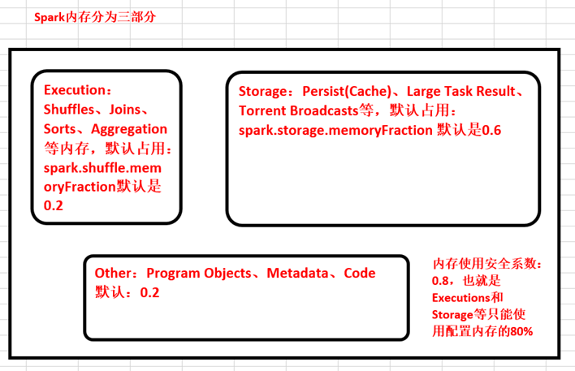

# 第54课：（重要需要重看）王家林谈Spark性能优化第十季之全球独家揭秘Spark统一内存管理！

标签： sparkIMF

---

##一：传统的Spark内存管理方式

 1. 由于分布式系统的性能杀手是Shuffle，Execution中Shuffle、Join、Sort、Aggregation只能使用一丁点的内存，那可能其他的内存就没有用，这个完全不是有效的内存的使用。
 2. 假设说这边要进行频繁的spill的话，而spill之后你要进行计算，你还要把数据搞到内存中，从磁盘中读数据到内存中你才能够计算，这个时候Storage磁盘IO是你无法承受的。
 3. 你可能说Storage内存空间不够的情况下，计算结果可能丢失，你可能要重新计算。
 4. 假设说一个Task占满了内存，其他的都是其他的Cores都是在空闲状态。你即使具体spill数据在到磁盘之间，它还是要申请一定百分比的空间放一部分数据的。
 
##Execution角度怎么分配内存

ShuffleMemoryManager
TaskMemoryManager
ExecutorAllocationManager

从我们这张图的角度来讲：它申请内存会有一个具体的机制，这机制导致了例如说一个Shuffle的任务过来，它有可能会占满所有的Execution的内存，就相当于我们在Storage中一个具体的Task过来，它可能占满所有的内存。

##从Storage的角度讲

任何数据都有StorageLevel。。。

最安全最廉价的StorageLevel是：MOMORY_AND_DISK_SER

unroll的内存空间是从Storage的Stage中获得的。

unroll调整的参数：spark.storage.unrollFraction 默认0.2
如果unroll的过程中失败，这个时候会把它放到磁盘上。

##Spark推出了统一内存管理 UnifiedMemoryManager
