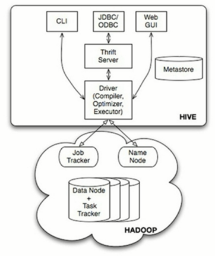

# 第55课：60分钟内从零起步驾驭Hive实战

标签： sparkIMF

---

##一：Hive的本质到底是什么

 1. Hive是分布式数据仓库，同时又是查询引擎，所以Spark SQL取代的只是Hive查询引擎，在企业实际生产环境下 Hive+Spark SQL是目前最为经典的数据分析组合。
 2. Hive本身就是一个简单的单机版本的软件，主要负责：
    * 把HQL翻译成Mapper(s)-Reducer-Mapper(s)的代码；并且可能产生很多MapReduce的Job；
    * 把生成的MapReduce代码及相关的资源打包成为Jar并发布到Hadoop集群中且进行运行（这一切都是自动的）；
 3. Hive本身的架构如下所示：
    

##二：Hive 安装和配置实战

 1. 我们使用的是Hive 1.2.1版本，
    * 配置 HIVE_HOME=/usr/local/hive-2.1.0
    * 配置 HIVE_CONF_DIR=/usr/local/hive-2.1.0/conf
 2. 将hive-env.sh.template文件重命名为 hive-env.sh
    * 添加配置 export HADOOP_HOME=/usr/local/hadoop-2.6.4
    * 添加配置 export HIVE_HOME=/usr/local/hive-2.1.0
    * 添加配置 export HIVE_CONF_DIR=/usr/local/hive-2.1.0/conf
 3. 将hive-default.xml.template文件复制新文件名称为 hive-site.xml，编辑内容为
    ```xml
    <?xml version="1.0" encoding="UTF-8" standalone="no"?>
    <?xml-stylesheet type="text/xsl" href="configuration.xsl"?>
    <configuration>
      <!-- WARNING!!! This file is auto generated for documentation purposes ONLY! -->
      <!-- WARNING!!! Any changes you make to this file will be ignored by Hive.   -->
      <!-- WARNING!!! You must make your changes in hive-site.xml instead.         -->
      <!-- Hive Execution Parameters -->
      <property>
    	<name>javax.jdo.option.ConnectionURL</name>
    	<value>jdbc:mysql://MasterWin:3306/hive?createDatabaseIfNotExist=true</value>
    	<description>JDBC connect string for a JDBC metastore</description>
      </property>
      <property>
    	<name>javax.jdo.option.ConnectionDriverName</name>
    	<value>com.mysql.jdbc.Driver</value>
    	<description>Driver class name for a JDBC metastore</description>
      </property>
      <property>
    	<name>javax.jdo.option.ConnectionUserName</name>
    	<value>root</value>
    	<dedication>username to use against metastore database</dedication>
      </property>
      <property>
    	<name>javax.jdo.ooption.ConnectionPassword</name>
    	<value>root</value>
    	<description>password to use against metastore database</description>
      </property>
      <property>
    	<name>hive.metastore.warehouse.dir</name>
    	<value>/user/hive/warehouse</value>
    	<description>location of default database for warehouse</description>
      </property>
    </configuration>
    ```

 4. Hive默认情况下放元数据的是Derby，遗憾的是Derby是单用户的，所以在生产环境下一般会采用支持多用户的数据库来进行Meta Store，且进行Master-Slaves主从读写分离和备份。我们最常使用MySQL。
 5. 在hive-site.xml中指定Hive数据仓库的具体存储：
    ```xml
    <property>
    	<name>hive.metastore.warehouse.dir</name>
    	<value>/user/hive/warehouse</value>
    	<description>location of default database for warehouse</description>
      </property>
    ```
    这个是数据仓库的数据具体存储在什么位置，这个是HDFS上的位置
    
 6. MySQL的安装和配置
 7. Hive的表有两种基本类型
    * 一种内部表（这种表数据属于Hive本身，言外之意是如果原来的数据在HDFS的其他地方，此时数据会通过HDFS移动到Hive数据仓库所在的目录下，如果删除Hive中的该表的话数据和元数据均会被删除）；
    * 另外一种属于外部表（这种表数据不属于Hive数据仓库，元数据中会表达具体数据在哪里，使用的时候和内部表的使用是一样的，只是如果通过Hive去删除的话，此时删除的只是元数据，并没有删除数据本身）；
 8. 配置好后直接进入hive

##三：使用Hive分析搜索数据


##Hive使用流程

 1. 启动HDFS
 2. 启动Yarn
 3. 启动MySQL
 4. 启动Hive

    ```sh
    #hive
    > show databases;
    > create database hive;
    > use hive;
    > show table;
    > select count(*) from sogouq1;
    > select count(*) from sogouq1 where WEBSIT like '%baidu%';
    > desc sogouq1;
    > select count(*) from sogouq1 where s_seq=1 and c_seq=1 and websit like '%baidu%' ;
    ```

##搜狗实验室数据

下载[搜狗实验室数据](http://www.sogou.com/labs/)
选择>数据资源>用户查询日志，下载迷你版或精简版数据
数据格式说明：

|访问时间|用户的ID|查询词|查询词的排名|点击的数量|用户点击的URL|
|---|---|---|---|---|---|
|00:00:00|2982199073774412|	[360安全卫士]|	8| 3| download.it.com.cn/17938.html |
|00:00:00|07594220010824798|[哄抢救灾物资]|1|1|news.21cn.com/social.html|

创建表语句
```sql
DROP TABLE IF EXISTS `sogouq1`;
CREATE TABLE `sogouq1` (
  `id` varchar(50) default NULL,
  `websession` varchar(50) default NULL,
  `word` varchar(200) NOT NULL,
  `s_seq` int(11) default NULL,
  `c_seq` int(11) default NULL,
  `website` varchar(500) default NULL
) ENGINE=InnoDB DEFAULT CHARSET=utf8;
```


##将文件上传到HDFS
hdfs dfs -mkdir /library/sogou
hadoop dfs -put /home/SogouQ.txt /library/sogou

##Hive使用
#bin/hive

* show databases;
* create database hive;
* show databases;
* use hive;
* create table SogouQ3(ID STRING,WEBSESSION STRING,WORD STRING,S_SEQ INT,C_SEQ INT,WEBSITE STRING) ROW FORMAT DELIMITED FIELDS TERMINATED BY '\t' LINES TERMINATED BY '\n' ;
* 此时如果出现错误：
    ```text
    FAILED: Execution Error, return code 1 from org.apache.hadoop.hive.ql.exec.DDLTask. MetaException(message:For direct MetaStore DB connections, we don't support retries at the client level.)
    ```
    
    这是由于字符集的问题，需要配置MySQL的字符集：
    mysql> alter database hive character set latin1;
* show tables;
* create table SogouQ2(ID STRING,WEBSESSION STRING,WORD STRING,S_SEQ INT,C_SEQ INT,WEBSITE STRING) ROW FORMAT DELIMITED FIELDS TERMINATED BY '\t' LINES TERMINATED BY '\n' ;
* 导入数据：
    * LOAD DATA LOCAL INPATH './home/SogouQ.txt' OVERWRITE INTO TABLE SogouQ;
    * LOAD DATA INPATH '/library/sogou/SogouQ.txt' OVERWRITE INTO TABLE SogouQ;
* 测试查询数据：select count(*) from SogouQ，如果没反应，启动Yarn即可。
* create table SogouQ1(ID STRING,WEBSESSION STRING,WORD STRING,S_SEQ INT,C_SEQ INT,WEBSITE STRING) ROW FORMAT DELIMITED FIELDS TERMINATED BY '\t' LINES TERMINATED BY '\n' ;
* LOAD DATA INPATH '/library/sogou/SogouQ1.txt' OVERWRITE INTO TABLE SogouQ1;
* select count(*) from SogouQ1 where WEBSITE like '%baidu%';
    结果返回129898条记录
* 通过搜狗搜索包含有baidu的数据，同时这个baidu的数据排名是第一位而且点击也是第一的：
    select count(*) from SogouQ1 where S_SEQ=1 and C_SEQ=1 and WEBSITE like '%baidu%';
    返回结果：59090
* 创建外部表
    CREATE EXTERNAL TABLE SogouQ2(ID STRING,WEBSESSION STRING,WORD STRING,S_SEQ INT,C_SEQ INT,WEBSITE STRING) ROW FORMAT DELIMITED FIELDS TERMINATED BY '\t' LINES TERMINATED BY '\n' STORED AS TEXTFILE LOCATION '/library/sogou/SogouQ2External';
* 将SogouQ1.txt和SogouQ.txt文件放入HDFS的/library/sogou/SogouQ2External目录中
* 执行查询语句：
    select count(*) from sogouq2;
    查询结果数据为1010000行。
* 执行查询：
    select count(*) from sogouq2 where S_SEQ=1 and C_SEQ=1;
* select WORD,count(WORD) as COUNTWord from SogouQ2 group by WORD order by COUNTWord desc limit 5; 

###External Table 和 Table有什么区别：

 * 外部表关联的时候只是把元数据弄到Hive中，在Hive中删除表的时候其实不会删除数据，只是把元数据删除掉。
 * 内部表的话删除表时，会删除数据。

##Hive处理的电商数据说明

tbDate.txt 日期的分类

|日期|年和月|年|月|日|周几|第几周|第几季度|上旬、中旬、下旬|上半月、下半月|
|--|--|--|--|--|--|--|--|--|--|
|2003-1-1|200301|2003|1|1|3|1|1|1|1|
|2003-1-2|200301|2003|1|2|4|1|1|1|1|

tbStock.txt 交易的数据，订单
|订单号|交易的位置|交易的日期|
|--|--|--|
|BYSL00000893|ZHAO|2007-8-23|
|BYSL00000897|ZHAO|2007-8-24|

tbStockDetail.txt   交易详情
|订单号|行号|订单订的产品|订单状态|数量|金额|
|--|--|--|--|--|--|
|BYSL00000893|0|FS527258160501|-1|268|-268|
|BYSL00000893|1|FS527258169701|1|268|268|

###导入到Hive

 1. create table tbData(dateID string,theYearMonth int,theYear int,theMonth int,theDay int,theWeek int,theWeeks int,theQuarter int,theTenDay int ,theHalfMonth int) ROW FORMAT DELIMITED FIELDS TERMINATED BY ',' LINES TERMINATED BY '\n';
 2. create table tbStock(orderNumber String,locationId String,dateId string) ROW FORMAT DELIMITED FIELDS TERMINATED BY ',' LINES TERMINATED BY '\n' ;
 3. create table tbStockDetail(orderNumber string,rowNum int,itemId string,state int, amount int,price int) ROW FORMAT DELIMITED FIELDS TERMINATED BY ',' LINES TERMINATED BY '\n';
 4. 数据导入Hive
    * load data local inpath '/home/tbDate.txt' into table tbData;
    * hadoop dfs -put /home/tbStock.txt /library
    * load data inpath '/library/tbStock.txt' into table tbStock
    * load data local inpath '/home/tbStockDetail.txt' into table tbStockDetail;
 5. 查询排名前10的年、季度销售排名
    ```sql
    select c.theYear,c.theQuarter,sum(b.amount) as sumofamount from tbStock a ,tbStockDetail b,tbData c where a.ordernumber=b.ordernumber and a.dateId=c.dateId group by c.theyear,c.theQuarter order by sumofamount desc limit 10;
    ```
    
    查询结果：
    ```text
    2008    1       6262470
    2007    1       5003428
    2007    4       4981228
    2008    2       4388007
    2007    3       4256733
    2006    4       4137579
    2007    2       4129133
    2006    1       3930709
    2005    1       3604165
    2006    2       3503080
    ```
    
 6. 销售金额在5万金额以上的
    ```sql
    select a.ordernumber,sum(b.amount) as sumofamount from tbStock a,tbStockDetail b where a.ordernumber=b.ordernumber group by a.ordernumber having sumofamount>50000;
    ```
    查询结果：
    ```text
    HMJSL00009957   52422
    HMJSL00009958   159864
    HMJSL00009959   57076
    HMJSL00010789   93926
    ```
 7. 复杂算法：计算年度最畅销的商品
     

### 在HDFS上如果直接把数据放入Hive数据仓库的话，会把数据直接剪切过去

###hive 三种启动方式及用途，关注通过jdbc连接的启动

1， hive  命令行模式，直接输入/hive/bin/hive的执行程序，或者输入 hive –service cli

    用于linux平台命令行查询，查询语句基本跟mysql查询语句类似

2， hive  web界面的启动方式，hive –service hwi  

    用于通过浏览器来访问hive，感觉没多大用途

3， hive  远程服务 (端口号10000) 启动方式，nohup hive –service hiveserver  & 

    用java等程序实现通过jdbc等驱动的访问hive就用这种起动方式了，这个是程序员最需要的方式了

启动hive service ：$HIVE_HOME/bin/hive --service hiveserver 10001 >/dev/null 2>/dev/null &
 
 
##hive问题及解决
 
1.hiveserver2启动后，beeline不能连接的涉及的问题：
原因：权限问题
解决：
/user/hive/warehouse
/tmp
/history (如果配置了jobserver 那么/history也需要调整)
这三个目录，hive在运行时要读取写入目录里的内容，所以把权限放开，设置权限：
hadoop fs -chmod -R 777 /tmp
hadoop fs -chmod -R 777 /user/hive/warehouse
2.beeline 链接拒绝报错信息
原因：官方的一个bug
解决：
hive.server2.long.polling.timeout

hive.server2.thrift.bind.host 注意把host改成自己的host
3.字符集问题、乱码的、显示字符长度问题的
原因：字符集的问题，乱码问题
解决：hive-site.xml中配置的mysql数据库中去 alter database hive character set latin1;
类似附件中的图片显示错误。
4.FAILED: Execution Error, return code 1 from org.apache.hadoop.hive.ql.exec.DDLTask. MetaException(message:For direct MetaStore DB connections, we don’t support retries at the client level.)
这个是由于我的mysql不再本地(默认使用本地数据库)，这里需要配置远端元数据服务器
hive.metastore.uris

thrift://lza01:9083
Thrift URI for the remote metastore. Used by metastore client to connect to rem
ote metastore. 然后在hive服务端启动元数据存储服务 hive –service metastore


5.FAILED: Execution Error, return code 1 from org.apache.hadoop.hive.ql.exec.DDLTask. MetaException(message:javax.jdo.JDODataStoreException: An exception was thrown while adding/validating class(es) : Specified key was too long; max key length is 767 bytes
修改mysql的字符集
alter database hive character set latin1;
转载请注明：云帆大数据学院（http://www.yfteach.com) » hiv安装问题及解决方法