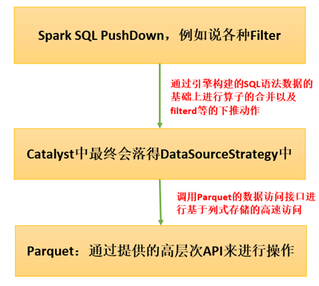

# 第66课：Spark SQL下Parquet中PushDown的实现 

标签： sparkIMF

---

##PushDown可以极大的提高效率

首先由各种Filter、where语句等等之类的，它会经过基本的语法解析生成语法树，在这个语法树的基础上它会进行正式的Spark引擎对它解析，最后它的优化器会对这个算子进行合并以及调整顺序。
当然它也会有Workflow，就是一个具体的执行的流程，最后会变成RDD的方式。RDD最后在执行的时候肯定要调用SQLNewHadoopRDD。

##本讲关注的Class

* QueryExecution
* Optimizer 优化器
* DataSourceStrategy
* PhysicalOperation
* SqlNewHadoopRDD

