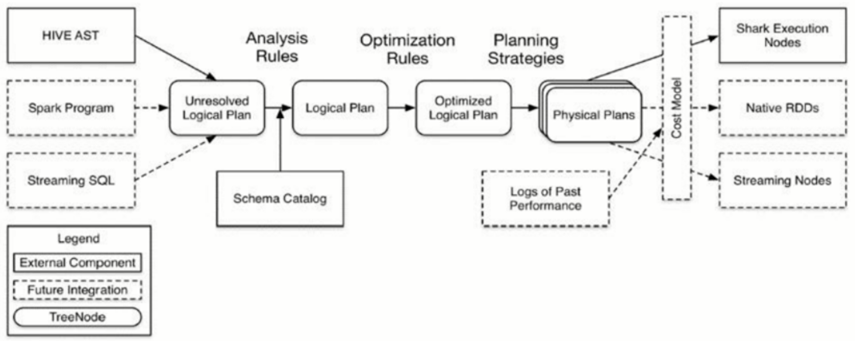

# 第81课：一节课贯通Spark SQL工作源码流程

标签： sparkIMF

---

##Spark SQL流程

##阅读源码

* SQLContext
* LogicalPlan
* AbstractSparkSQLParser
* DataFrame
* QueryExecution
* RuleExecutior
* Optimizer
* DefualtOptimizer

如果你想学会写SQL的性能优化，最快的途径就是看DefualtOptimizer怎么优化的！

