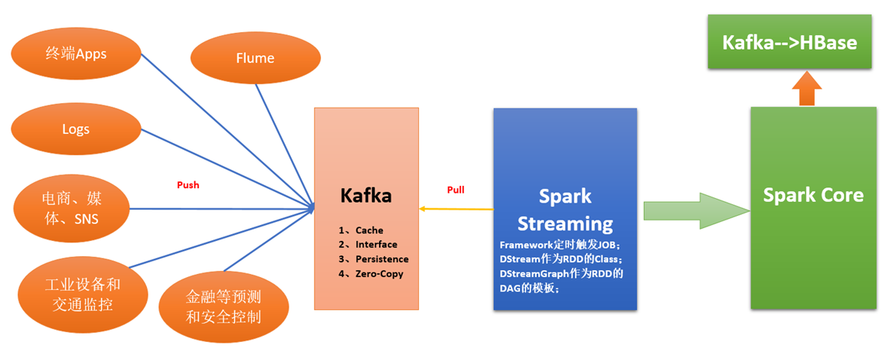

# 第82课：Spark Streaming第一课：案例动手实战并在电光石火间理解其工作原理

标签： sparkIMF

---

##Spark Streaming 概述

##第一个Spark Streaming 案例

* 启动Spark集群
* linux下启动nc服务器
    $ nc -lk 9999
    hello world
* 启动./bin/run-example streaming.NetworkWordCount localhost 9999
* 观察控制台执行结果
```sh
Time: 1357008430000 ms
-------------------------------------------
(hello,1)
(world,1)
```

##Spark Streaming数据实际生产环境下技术架构



###为什么使用Kafka？为什么数据不直接把数据交给Spark Streaming呢？两大原因：
* 直接交给Spark Streaming，如果计算不完怎么办？
* Spark Streaming可以提取时间段之前的数据！

###Spark Streaming不是基于RDD的，因为RDD是不可变的，而是基于DStream的
DStream离散流，内部有RDD。
RDD的模板就是DStream。

##Spark Streaming 和 Stom最大的不同点在于：

* Stom天生是一条一条去计算的；
* Spark Streaming是按照时间段去处理的；
* Stom是基于内容的记录Record。
* Spark Streaming是基于时间单位的，跟内容无关。
