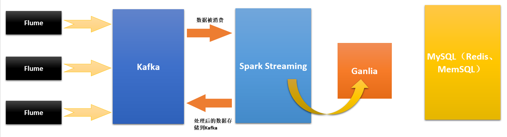

# 第86课：SparkStreaming数据源Flume实际案例分享

标签： sparkIMF

---

##Flume



生产环境下，最佳模式就是收集分布式日志或者分布式的数据，一般以Kafka为核心。

##搭建好Flume（Win系统）

 1. 进入[Flume官网](http://flume.apache.org)下载Flume
 2. 解压到G:\runtime\flume-1.6.0文件夹
 3. 配置FLUME_HOME
    ```sh
    FLUME_HOME=G:\runtime\flume-1.6.0
    ```
    
 4. 配置好Path
    ```sh
    %FLUME_HOME%\bin;
    ```
    
 5. 执行测试：
    ```sh
    flume-ng version
    ```
    
 6. 根据官网的说明，继续执行
    ```sh
    flume-ng agent -n example -c conf -f conf/flume-conf.properties
    ```
    
 7. conf目录下新建文件example.conf
    ```sh
    # example.conf: A single-node Flume configuration

    # Name the components on this agent
    a1.sources = r1
    a1.sinks = k1
    a1.channels = c1
    
    # Describe/configure the source
    a1.sources.r1.type = netcat
    a1.sources.r1.bind = localhost
    a1.sources.r1.port = 44444
    
    # Describe the sink
    a1.sinks.k1.type = logger
    
    # Use a channel which buffers events in memory
    a1.channels.c1.type = memory
    a1.channels.c1.capacity = 1000
    a1.channels.c1.transactionCapacity = 100
    
    # Bind the source and sink to the channel
    a1.sources.r1.channels = c1
    a1.sinks.k1.channel = c1
    ```
    
 8. 执行这个文件
    ```sh
    flume-ng agent -c conf --conf-file conf/example.conf --name a1 -Dflume.root.logger=INFO,console
    ```
    如果上述执行有问题可以去掉-D和后面的参数：
    ```sh
    flume-ng agent -c conf --conf-file conf/example.conf --name a1
    ```
    
 9. **注意在Windows系统下-Dflume.root.logger=INFO,console这个参数不能传入，如何解决：**
    在bin目录下的flume-ng.ps1文件中158行function runFlume函数中，在-Djava.library.path参数后面加入-Dflume.root.logger=INFO,console即可！完整的语句如下：
    ```sh
    [string]$fullJavaCommand = "-classpath $javaClassPath -Djava.library.path=$javaLibraryPath -Dflume.root.logger=INFO,console $javaOptions $class $javaProcessArgumentList"
    ```
    
 10. 启动telnet进行测试：
    ```sh
    $ telnet localhost 44444
    Trying 127.0.0.1...
    Connected to localhost.localdomain (127.0.0.1).
    Escape character is '^]'.
    Hello world! <ENTER>
    OK
    ```
    
 11. 观察执行结果：
    ```sh
    2/06/19 15:32:19 INFO source.NetcatSource: Source starting
    12/06/19 15:32:19 INFO source.NetcatSource: Created serverSocket:sun.nio.ch.ServerSocketChannelImpl[/127.0.0.1:44444]
    12/06/19 15:32:34 INFO sink.LoggerSink: Event: { headers:{} body: 48 65 6C 6C 6F 20 77 6F 72 6C 64 21 0D          Hello world!. }
    ```
    

