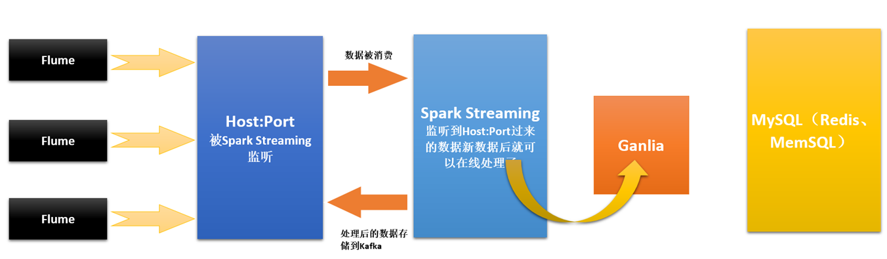

# 第87课：Flume推送数据到SparkStreaming案例实战和内幕源码解密

标签： sparkIMF

---

##本讲主要内容流程图：



##和王老师的Flume保持一致

* flume-conf.properties
    ```sh
    # The configuration file needs to define the sources, 
    # the channels and the sinks.
    # Sources, channels and sinks are defined per agent, 
    # in this case called 'agent'
    
    #agent1表示代理名称
    agent1.sources = source1
    agent1.channels = channel1
    agent1.sinks = sink1
    
    #配置source1
    # For each one of the sources, the type is defined
    agent1.sources.source1.type = spooldir
    #agent1.sources.source1.spooldir=/usr/local/flume-1.6.0/tmp/TestDir
    agent1.sources.source1.spoolDir=z:/flumeTmpDir/TestDir
    agent1.sources.source1.ignorePattern = ^(.)*\\.tmp$
    # The channel can be defined as follows.
    agent1.sources.source1.channels = channel1
    
    agent1.sources.source1.fileHeader = false
    agent1.sources.source1.interceptors = i1
    agent1.sources.source1.interceptors.i1.type = timestamp
    
    #配置sink1
    #agent1.sinks.sink1.type=hdfs
    #agent1.sinks.sink1.hdfs.path=hdfs://MasterWin:9000/library/flume
    #agent1.sinks.sink1.hdfs.fileType=DataStream
    #agent1.sinks.sink1.hdfs.writeFormat=TEXT
    #agent1.sinks.sink1.hdfs.rollInterval=1
    #agent1.sinks.sink1.hdfs.filePrefix=%Y-%m-%d
    agent1.sinks.sink1.type = avro
    agent1.sinks.sink1.channel = channel1
    agent1.sinks.sink1.hostname = MasterWin
    agent1.sinks.sink1.port = 9999
    
    #配置channel1
    # Each channel's type is defined.
    agent1.channels.channel1.type=file
    #agent1.channels.channel1.checkpointDir=/usr/local/flume-1.6.0/tmp/checkpointDir
    #agent1.channels.channel1.dataDirs=/usr/local/flume-1.6.0/tmp/dataDirs
    agent1.channels.channel1.checkpointDir=z:/flumeTmpDir/checkpointDir
    agent1.channels.channel1.dataDirs=z:/flumeTmpDir/dataDirs
    ```
    
* 启动Flume
    ```sh
    flume-ng agent -c conf --conf-file conf/flume-conf.properties --name agent
    ```
    linux系统下可以参加参数-Dflume.root.logger=INFO,console
* 把文件复制到Z:\flumeTmpDir\TestDir观察控制台变化

##代码实战

FlumePushData2SparkStreaming.java

```java
package com.dtspark.sparkapps.streaming;

import org.apache.spark.SparkConf;
import org.apache.spark.storage.StorageLevel;
import org.apache.spark.streaming.Durations;
import org.apache.spark.streaming.api.java.*;
import org.apache.spark.streaming.flume.FlumeUtils;
import org.apache.spark.streaming.flume.SparkFlumeEvent;
import scala.Tuple2;
import scala.actors.threadpool.Arrays;

/**
 * 第87课：Flume推送数据到SparkStreaming案例实战
 * Created by Limaoran on 2016/7/11.
 */
public class FlumePushData2SparkStreaming {
    public static void main(String[] args) {
        String pathCheckpoint = "z:/checkpoint/";

        SparkConf conf = new SparkConf().setAppName("FlumePushData2SparkStreaming").setMaster("local[4]");
        JavaStreamingContext jsc = new JavaStreamingContext(conf, Durations.seconds(15));
        jsc.checkpoint(pathCheckpoint);
        /**
         * 此处没有Receiver，SparkStreaming应用程序只是按照时间间隔监控目录下每个Batch新增的内容
         *  （把新增的）作为RDD的数据来源生成原始RDD。
         */
        JavaReceiverInputDStream<SparkFlumeEvent> receiverInputDStream = FlumeUtils.createStream(jsc,"MasterWin",9999);
        JavaDStream<String> words = receiverInputDStream.flatMap(event ->{
            String line = new String( event.event().getBody().array());
            return Arrays.asList(line.split(" "));
        });
        JavaPairDStream<String,Integer> wordsCount = words.mapToPair(word -> new Tuple2<String, Integer>(word, 1));
        JavaPairDStream<String,Integer> wordsCounts = wordsCount.reduceByKey((v1,v2)->v1+v2);
        wordsCounts.print();
//        wordsCounts.foreachRDD(rdd->{
//            rdd.foreach(tuple -> {
//                System.out.println("Key:"+tuple._1()+",Value:"+tuple._2());
//            });
//        });
        jsc.start();
        jsc.awaitTermination();
    }
}
```

##阅读源码

* FlumeUtils.createStream
* SparkFlumeEvent
* FlumeInputDStream
* ReceiverInputDStream


##Flume和Kafka之间的选择

* 如果数据一直是大规模或者持续不断的产生的话，这时候一般采用Kafka！
* 或者说如果有时候数据量特别大，有时候数据量特别小，有时候几个小时都不产生数据，这个时候没有必要用Kafka，推荐Flume！

