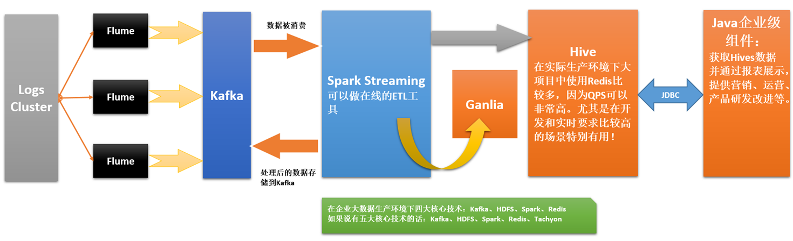

# 第100课：使用Spark Streaming+ Spark SQL + Kafka+FileSystem综合案例

标签： sparkIMF

---

##案例分析架构图



##代码实战

```scala
package com.dt.spark.sparkapps.streaming

import kafka.serializer.StringDecoder
import org.apache.spark.SparkConf
import org.apache.spark.sql.hive.HiveContext
import org.apache.spark.streaming.{StreamingContext, Seconds}


/**
 * 第100课：使用Spark Streaming+ Spark SQL + Kafka+FileSystem综合案例
 * Created by Limaoran on 2016/7/14.
 */
case class MessageItem(name:String,age:Int)

object SparkStreamingFromKafkaFlume2Hive {
  def main(args: Array[String]) {
    if(args.length<2){
      System.err.println("Please input your Kafka Broker List and topics to consume")
      System.exit(1)
    }
    val conf = new SparkConf()
    conf.setAppName("SparkStreamingFromKafkaFlume2Hive")
    conf.setMaster("local[4]")

    val ssc = new StreamingContext(conf,Seconds(5))

    val Array(brokers,topicList) = args
    val kafkaParams = Map[String,String]("metadata.broker.list" -> brokers)
    val topics = topicList.split(",").toSet

    import org.apache.spark.streaming.kafka.KafkaUtils
    KafkaUtils.createDirectStream[String,String,StringDecoder,StringDecoder](ssc,kafkaParams,topics)
      .map(_._2.split(",")).foreachRDD(rdd=>{

      val hiveContext = new HiveContext(rdd.sparkContext)

      import hiveContext.implicits._  //导入.toDF() 隐式转换
      rdd.map(record => MessageItem(record(0).trim,record(1).trim.toInt)).toDF().registerTempTable("temp")
      hiveContext.sql("select count(*) from temp").show()
    })

    /**
     * TODO 大家今天的作业：
     *    1.把数据写入到Hive中；
     *    2.通过Java技术访问Hive中的内容；
     *    3.通过Flume做最原始的数据收集；
     *    4.Flume会作为Kafka的Producer把数据写入到Kafka中供本程序消费处理；
     */


    ssc.start()
    ssc.awaitTermination()
  }
}
```

##Flume和Kafka进行整合

###Kafka也可以监控一个文件夹，为什么还要用Flume和Kafka整合呢？

 1. Flume可以收集分布式日志
 2. 性能原因
 3. Kafka要求读取文件格式是json，你的数据很多情况下都不是json格式，要自定义一个读取器，
 4. 生产环境下Kafka一般很少直接读文件，是放消息的。例如说


##配置Flume和Kafka整合环境

* 配置参数配置文件
```properties
#agent3表示代理名称
agent3.sources = source1
agent3.channels = channel1
agent3.sinks = sink1

#配置source1
# For each one of the sources, the type is defined
agent3.sources.source1.type = spooldir
#agent3.sources.source1.spooldir=/usr/local/flume-1.6.0/tmp/TestDir
agent3.sources.source1.spoolDir=z:/flumeTmpDir/TestDir
agent3.sources.source1.ignorePattern = ^(.)*\\.tmp$
# The channel can be defined as follows.
agent3.sources.source1.channels = channel1

agent3.sources.source1.fileHeader = false
agent3.sources.source1.interceptors = i1
agent3.sources.source1.interceptors.i1.type = timestamp

#配置sink1
# === hdfs ===
#agent3.sinks.sink1.type=hdfs
#agent3.sinks.sink1.hdfs.path=hdfs://MasterWin:9000/library/flume
#agent3.sinks.sink1.hdfs.fileType=DataStream
#agent3.sinks.sink1.hdfs.writeFormat=TEXT
#agent3.sinks.sink1.hdfs.rollInterval=1
#agent3.sinks.sink1.hdfs.filePrefix=%Y-%m-%d

#agent3.sinks.sink1.type = avro
#agent3.sinks.sink1.channel = channel1
#agent3.sinks.sink1.hostname = MasterWin
#agent3.sinks.sink1.port = 9999

# === spark ===
#agent3.sinks = spark
#agent3.sinks.spark.type = org.apache.spark.streaming.flume.sink.SparkSink
#agent3.sinks.spark.hostname = MasterWin
#agent3.sinks.spark.port = 9999
#agent3.sinks.spark.channel = channel1
# === kafka ===
agent3.sinks.sink1.type=org.apache.flume.plugins.KafkaSink
agent3.sinks.sink1.metadata.broker.list=localhost:9092
agent3.sinks.sink1.partition.key=0
agent3.sinks.sink1.partitioner.class=org.apache.flume.plugins.SinglePartition
agent3.sinks.sink1.request.required.acks=0
agent3.sinks.sink1.max.message.size=1000000
agent3.sinks.sink1.producer.type=sync
agent3.sinks.sink1.custom.encoding=UTF-8
agent3.sinks.sink1.custom.topic.name=HelloKafka
agent3.sinks.sink1.channel=channel1

#配置channel1
agent3.channels.channel1.type=file
agent3.channels.channel1.checkpointDir=z:/flumeTmpDir/checkpointDir
agent3.channels.channel1.dataDirs=z:/flumeTmpDir/dataDirs
```
* 下载Jar文件
* 把Jar文件放入Flume/lib目录中

