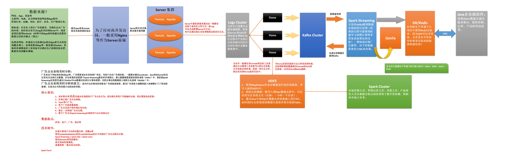

# 第104课：Spark Streaming电商广告点击综合案例需求分析和技术架构

标签： sparkIMF

---

##广告点击系统实时分析：

广告来自于网站或者移动App等，广告需要设定在具体的广告位，当用户点击广告的时候，一般都会通过JavaScript、Ajax或者Socket往后台发送点击的日志数据，在这里我们是要基于Spark Streaming做实时在线统计，那么数据就需要放进消息系统（Kafka）中，我们的Spark Streaming应用程序j就会去Kafka中Pull数据过来进行计算和消费，并把计算后的数据放入到持久化系统（MySQL）中。
广告点击系统实时分析的意义：因为可以在线实时的看见广告的投放效果，就为广告的更大规模的投入和调整打下了坚实的基础。从而为公司带来最大化的经济回报。

##核心需求：

 1. 实时黑名单动态过滤出有效的用户广告点击行为；因为黑名单用户可能随时出现，所以需要动态更新。
 2. 在线计算广告点击流量；
 3. Top3 热门广告；
 4. 每个广告的流量趋势，
 5. 广告点击用户的区域分布分析；
 6. 最近一分钟的广告点击量；
 7. 整个广告点击Spark Streaming处理程序7*24小时的运行

##数据格式：

时间、用户、广告、地点等

##技术细节：

* 在线计算用户点击的次数分析、屏蔽ip等
* 使用updateStateByKey或者mapWithState进行不同地区广告点击排名计算；
* Spark Streaming + Spark SQL + Spark Core；
* 使用Window类型的操作；
* 高可用和性能调优；
* 流量趋势 一般会结合DB等；

##广告点击系统需求分析与技术架构流程图

