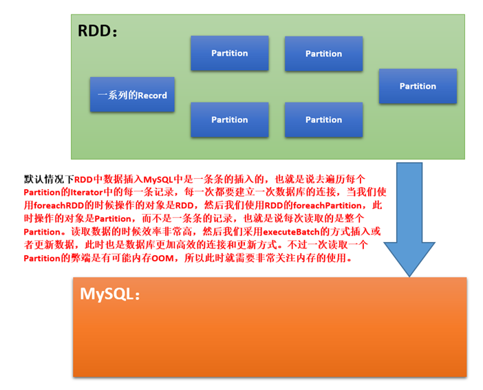

# 第109课：Spark Streaming电商广告点击综合案例动态黑名单基于数据库MySQL的真正操作代码实战

标签： sparkIMF

---

##Spark高效的操作数据库



##代码实战

###主程序：AdClickedStreamStates.java

```java
package com.dtspark.sparkapps.streaming.ads;

import kafka.serializer.StringDecoder;
import org.apache.spark.SparkConf;
import org.apache.spark.api.java.JavaPairRDD;
import org.apache.spark.api.java.JavaRDD;
import org.apache.spark.streaming.Durations;
import org.apache.spark.streaming.api.java.JavaDStream;
import org.apache.spark.streaming.api.java.JavaPairDStream;
import org.apache.spark.streaming.api.java.JavaPairInputDStream;
import org.apache.spark.streaming.api.java.JavaStreamingContext;
import org.apache.spark.streaming.kafka.KafkaUtils;
import scala.Tuple2;

import java.util.*;

/**
 * 第105-109课：Spark Streaming电商广告点击综合案例在线点击统计实战
 * Created by Limaoran on 2016/7/14.
 *
 * 在线处理广告点击流
 * 广告点击的基本数据格式：timestemp、ip、userID、adID、province、city
 */
public class AdClickedStreamStates {
    public static void main(String[] args) {
        SparkConf conf = new SparkConf().setAppName("AdClickedStreamStates")
                .setMaster("local[4]");
        JavaStreamingContext jsc = new JavaStreamingContext(conf, Durations.seconds(5));

        Map<String,String> kafkaParameters = new HashMap<>();
        kafkaParameters.put("metadata.broker.list", "MasterWin:9092");
        Set<String> topics = new HashSet<>();
        topics.add("AdClicked");
        JavaPairInputDStream<String,String> adClickStream = KafkaUtils.createDirectStream(jsc,
                String.class, String.class, StringDecoder.class, StringDecoder.class,
                kafkaParameters, topics);
        /**
         * 因为要对黑名单进行在线过滤，而数据是在RDD中的，所以必然使用transform这个函数。
         * 但是在这里我们必须使用transformToPair，原因是读取进来的Kafka的数据是Pair<String,String>类型的；
         * 另外一个原因是过滤后的数据要进行进一步处理，所以必须是读进来的Kafka数据的原始类型DStream<String,String>
         *
         * 在此：再次说明每个Batch Duration中实际上讲输入的数据就是被一个且仅被一个RDD封装的，
         *  你可以有多个InputStream，但其实在产生Job的时候，这些不同的InputDStream在Batch Duration中
         *  就相当于Spark基于HDFS数据操作的不同文件来源而已罢了。
         */
        //1.过滤黑名单
        JavaDStream<String> filteredadClickedDStream = adClickStream.transform((JavaPairRDD<String, String> rdd) -> {
            /**
             * 在线黑名单过滤思路：
             * 1，从数据库中获取黑名单转换成RDD，即用新的RDD实例封装黑名单数据。
             * 2，然后把代表黑名单的RDD的实例和Batch Duration产生的rdd进行Join操作，
             *      准确的说是进行leftOuterJoin操作，也就是说Batch Duration产生的rdd和代表黑名单的rdd实例
             *      进行leftOuterJoin操作，如果两者都有内容的话，就会使true，否则的话就是false；
             *
             * 我们要留下的是leftOuterJoin操作结果为false；
             */
            //数据来自于查询的黑名单的表，并且映射为<String,Boolean>
            List blackListFromDB = new BlackDBOpt().blackListFromDB();
            /**
             * 黑名单的表中只有userID，但是如果要进行join操作的话，就必须是Key-Value，所以
             *  在这里我们需要基于数据表中的数据产生Key-Value类型的数据集合。
             */
            //数据格式：Tuple2<String,Boolean>
            JavaPairRDD blackListRDD = jsc.sparkContext().parallelizePairs(blackListFromDB);

            /**
             * 进行操作的时候肯定是基于userID进行join的，所以必须把传入的rdd进行mapToPair操作
             * 转换成为符合格式的rdd
             */
            JavaPairRDD<String, String> rdd2Pair = rdd.mapToPair(tuple2 -> {
                String userID = tuple2._2().split("\t")[2];
                return new Tuple2(userID, tuple2._2());
            });
            JavaPairRDD<String, Tuple2<String, Optional<Boolean>>> joinedRDD = rdd2Pair.leftOuterJoin(blackListRDD);
            JavaPairRDD<String, Tuple2<String, Optional<Boolean>>> filterRDD = joinedRDD.filter(tuple2 -> {
                if (true == tuple2._2()._2().orElse(false)) {
                    return false;
                } else {
                    return true;
                }
            });
            JavaRDD<String> resultRDD = filterRDD.map(tuple2 -> {
                return tuple2._2()._1();
            });
            return resultRDD;
        });

        //数据格式：timestemp、ip、userID、adID、province、city
        JavaPairDStream<String,Long> pairDStream = filteredadClickedDStream.mapToPair(line -> {
            String[] splited = line.split("\t");
            String timestamp = splited[0];  //yyyy-MM-dd
            String ip = splited[1];
            String userID = splited[2];
            String adID = splited[3];
            String province = splited[4];
            String city = splited[5];
            String clickedRecord = timestamp + "_" + ip + "_" + userID + "_" + adID + "_" + province + "_" + city;
            return new Tuple2(clickedRecord, 1L);
        });
        /**
         * 计算每个Batch Duration中每个User的广告点击量
         * 2.统计广告点击次数
         */
        JavaPairDStream<String,Long> adClickedUsers = pairDStream.reduceByKey((v1,v2)->v1+v2);
        /**
         * 计算出什么叫有效的点击？
         * 1，复杂化的一般都是采用机器学习训练好模型直接在线进行过滤；
         * 2，简单的可以通过一个Batch Duration中的点击次数来判断是不是非法广告点击，但是
         *  实际上讲非法广告点击程序会尽可能的模拟真实的广告点击行为，所以通过一个Batch来判断
         *  是不完整的，我们需要对例如一天（也可以是每一小时）的数据进行判断！
         * 3，比在线机器学习退而求其次的做法如下：
         *  例如：一段时间内，同一个IP（MAC地址）有多个账号访问
         *  例如：可以统计一天内一个用户点击广告的次数，如果一天点击同样的广告超过50次的话，
         *      就列入黑名单。
         *
         * 黑名单有一个重要的特征：动态生成！所以每一个Batch Duration都要考虑是否有新的黑名单加入，此时黑名单需要存储起来。
         *  具体存储在什么地方呢，存储在DB/Redis中即可！
         *
         * 例如邮件系统中的“黑名单”，可以采用Spark Streaming不断的监控每个用户的操作，
         *  如果用户发送邮件的频率超过了设定的值，可以暂时把用户列入“黑名单”，从而阻止用户过度频繁的发送邮件。
         */
        JavaPairDStream<String,Long> filteredClickedInBatch = adClickedUsers.filter(tuple->{
            if(tuple._2() > 1){ //每10秒钟，点击超过1次，判为非法点击
                //更新一下黑名单的数据表
                return false;
            }else{
                return true;
            }
        });
//        filteredClickedInBatch.print();
        filteredClickedInBatch.foreachRDD(rdd -> {
            rdd.foreachPartition(record -> {
                /**
                 * 在这里我们使用数据库连接池的高效读写数据库的方式把数据写入数据库MySQL；
                 * 由于传入的参数是一个Iterator类型的集合，所以为了更加高效的操作，我们需要批量处理；
                 * 例如说一次性插入1000条Record，使用insertBatch或者updateBatch类型的操作
                 * 插入的用户信息可以只包含：userID、adID、clickedCount
                 * 这里面有一个问题：可能出现两条记录的Key是一样的，此时就需要更新累加操作
                 */
                //有效数据插入MySQL中（格式：time、ip、userID、adID、province、city）
                List<UserAdClicked> userAdClickedList = new ArrayList<UserAdClicked>();
                while(record.hasNext()){
                    Tuple2<String,Long> tuple2 = record.next();
                    String [] splited = tuple2._1().split("\t");
                    UserAdClicked userAdClicked = new UserAdClicked();
                    userAdClicked.setTimestamp(splited[0]);
                    userAdClicked.setIp(splited[1]);
                    userAdClicked.setUserID(splited[2]);
                    userAdClicked.setAdID(splited[3]);
                    userAdClicked.setProvince(splited[4]);
                    userAdClicked.setCity(splited[5]);
                    userAdClickedList.add(userAdClicked);
                }
                new BlackDBOpt().saveAds(userAdClickedList);
            });
        });
        JavaPairDStream<String,Long> blackListOnHistory = filteredClickedInBatch.filter(tuple -> {
            //广告点击的基本数据格式：timestemp、ip、userID、adID、province、city
            String [] splited = tuple._1().split("_");
            String date = splited[0];
            String userID = splited[2];
            String adID = splited[3];
            /**
             * 接下来根据date、userID、adID等条件去查询用户点击广告的数据表，获得总的点击次数。
             * 这个时候基于点击次数判断是否属于黑名单点击
             */
            int clickedCountTotalToday = 81;
            if(clickedCountTotalToday>50){
                return true;
            }else{
                return false;
            }
        });

        /**
         * 对黑名单的整个RDD进行去重操作！！！
         */
        JavaDStream<String> blackListUniqueUserIDBaseOnHistory = blackListOnHistory.map(tuple2 -> {
            return tuple2._1().split("_")[2];
        });
        JavaDStream<String> distinctDStream = blackListUniqueUserIDBaseOnHistory.transform((JavaRDD<String> rdd) -> {
            return rdd.distinct();
        });

        //下一步写入黑名单数据表中
        distinctDStream.foreachRDD(rdd->{
            rdd.foreachPartition(record -> {
                /**
                 * 插入的用户信息可以只包含：userID
                 * 此时直接插入黑名单数据表即可。
                 */
                List<String> blackList = new ArrayList<String>();
                while(record.hasNext()){
                    blackList.add(record.next());
                }
                new BlackDBOpt().saveBlackList(blackList);
            });
        });

        jsc.start();
        jsc .awaitTermination();
    }
}
```

###广告、黑名单数据库操作的封装：BlackDBOpt.java

```java
package com.dtspark.sparkapps.streaming.ads;

import scala.Tuple2;

import java.sql.PreparedStatement;
import java.sql.ResultSet;
import java.util.ArrayList;
import java.util.List;

/**
 * 第109课：Spark Streaming电商广告点击综合案例动态黑名单基于数据库MySQL的真正操作代码实战
 * Created by Limaoran on 2016/7/15.
 *
 * 有关黑名单的数据库操作
 */
public class BlackDBOpt {
    /**
     * 获取黑名单列表
     * @return 数据格式：Tuple2<String,Boolean>
     */
    public List<Tuple2<String,Boolean>> blackListFromDB(){
        JDBCWrapper wrapper = JDBCWrapper.getJDBCInstance();
        List<Tuple2<String,Boolean>> list = new ArrayList<>();
        wrapper.doQuery("select * from blacklistTable", null, (ResultSet resultSet)->{
            while(resultSet.next()){
                list.add(new Tuple2(resultSet.getString("blackName"),true));
            }
            resultSet.close();
        });
        return list;
    }

    /**
     * 保存黑名单
     * @param lists
     * @return
     */
    public int[] saveBlackList(List<String> lists){
        JDBCWrapper wrapper = JDBCWrapper.getJDBCInstance();
        List<Object[]> paramList = new ArrayList<>();
        for(String str: lists){
            paramList.add(new String[]{str});
        }
        return wrapper.doBatch("INSERT INTO blacklistTable VALUES (?)",paramList);
    }

    /**
     * 保存用户广告点击<br/>
     * 流程：<br/>
     *  判断当天用户是否点击过广告:<br/>
     *      1.如果点击过，则更新点击次数；<br/>
     *      2.否则新增记录；<br/>
     * @param list
     */
    public void saveAds(List<UserAdClicked> list){
        JDBCWrapper wrapper = JDBCWrapper.getJDBCInstance();

        List<UserAdClicked> inserting = new ArrayList<>();
        List<UserAdClicked> updating = new ArrayList<>();
        //adclicked 表的字段：timestamp、ip、userID、adID、province、city、clickedCount
        for(UserAdClicked clicked:list) {
            wrapper.doQuery("SELECT count(1) FROM adclicked WHERE timestamp=? and userID=? and adID=?",
                    new Object[]{clicked.getTimestamp(),clicked.getUserID(),clicked.getAdID()},resultSet->{
                if(resultSet.next()){
                    long count = resultSet.getLong(1);
                    if(count>0){
                        //后续更新
                        clicked.setCount(count+1);
                        updating.add(clicked);
                    }else{  //后续插入
                        clicked.setCount(1L);
                        inserting.add(clicked);
                    }
                }
            });
        }
        //插入
        wrapper.doBatch("INSERT INTO adclicked VALUES(?,?,?,?,?,?,?)",inserting,(UserAdClicked bean,PreparedStatement pst)->{
            pst.setString(1,bean.getTimestamp());
            pst.setString(2,bean.getIp());
            pst.setString(3,bean.getUserID());
            pst.setString(4,bean.getAdID());
            pst.setString(5,bean.getProvince());
            pst.setString(6,bean.getCity());
            pst.setLong(7, bean.getCount());
        });
        //更新
//        wrapper.doBatch("UPDATE adclicked SET COUNT=COUNT+1 WHERE timestamp=? and userID=? and adID=?",updating,(UserAdClicked bean,PreparedStatement pst)->{
        wrapper.doBatch("UPDATE adclicked SET COUNT=? WHERE timestamp=? and userID=? and adID=?",updating,(UserAdClicked bean,PreparedStatement pst)->{
            pst.setLong(1,bean.getCount());
            pst.setString(2,bean.getTimestamp());
            pst.setString(3,bean.getUserID());
            pst.setString(4, bean.getAdID());
        });
    }
}
```

###JDBC封装简化操作：JDBCWrapper.java

```java
package com.dtspark.sparkapps.streaming.ads;

import java.sql.*;
import java.util.List;
import java.util.concurrent.LinkedBlockingQueue;

/**
 * 第107、109课：JDBC 包装器（基于MySQL）
 * Created by Limaoran on 2016/7/15.
 */
public class JDBCWrapper{
    static{
        try {
            Class.forName("com.mysql.jdbc.Driver");
        } catch (ClassNotFoundException e) {
            e.printStackTrace();
        }
    }
    private static JDBCWrapper jdbcInstance;
    public static JDBCWrapper getJDBCInstance(){
        if(jdbcInstance==null){
            synchronized (JDBCWrapper.class){
                if(jdbcInstance==null){
                    jdbcInstance = new JDBCWrapper();
                }
            }
        }
        return jdbcInstance;
    }
    private LinkedBlockingQueue<Connection> dbConnectionPool = new LinkedBlockingQueue<>();
    private JDBCWrapper(){
        try {
            //"jdbc:mysql://localhost:3306/spark?user=root&password=root"
            for(int i=0;i<5;i++) {
                Connection con = DriverManager.getConnection("jdbc:mysql://localhost:3306/spark", "root", "root");
                dbConnectionPool.put(con);
            }
        } catch (Exception e) {
            e.printStackTrace();
        }
    }
    public Connection getConnection(){
        while(dbConnectionPool.size()==0){ //如果池子里没有，则等待一会
            try {
                Thread.sleep(20);
            } catch (InterruptedException e) {
                e.printStackTrace();
            }
        }
        return dbConnectionPool.poll();
    }
    public void returnConnectioin(Connection con){
        try {
            dbConnectionPool.put(con);
        } catch (InterruptedException e) {
            e.printStackTrace();
        }
    }
    public int[] doBatch(String sqlText,List<Object[]> paramsList){
        Connection con = getConnection();
        PreparedStatement pst = null;
        int[] result = null;
        try {
            con.setAutoCommit(false);
            pst = con.prepareStatement(sqlText);
            for(Object[] parameters:paramsList){
                for(int i=0;i<parameters.length;i++){
                    pst.setObject(i+1,parameters[i]);
                }
                pst.addBatch();
            }
            result = pst.executeBatch();
            con.commit();
//            pst.close();
        } catch (SQLException e) {
            e.printStackTrace();
        }finally {
            if(pst!=null){
                try {
                    pst.close();
                } catch (SQLException e) {
                    e.printStackTrace();
                }
            }
            if(con!=null) {
                returnConnectioin(con);
            }
        }
        return result;
    }
    public<T> int[] doBatch(String sqlText,List<T> paramsList,ExecuteParamCallBack<T> callBack){
        Connection con = getConnection();
        PreparedStatement pst = null;
        int[] result = null;
        try {
            con.setAutoCommit(false);
            pst = con.prepareStatement(sqlText);
            for(T t:paramsList){
                callBack.setParameters(t,pst);
                pst.addBatch();
            }
            result = pst.executeBatch();
            con.commit();
//            pst.close();
        } catch (SQLException e) {
            e.printStackTrace();
        }finally {
            if(pst!=null){
                try {
                    pst.close();
                } catch (SQLException e) {
                    e.printStackTrace();
                }
            }
            if(con!=null) {
                returnConnectioin(con);
            }
        }
        return result;
    }
    public void doQuery(String sqlText,Object[] params,ExecuteCallBack callBack){
        Connection con = getConnection();
        PreparedStatement pst = null;
        ResultSet result = null;
        try {
            pst = con.prepareStatement(sqlText);
            for(int i=0;i<params.length;i++){
                pst.setObject(i+1,params[i]);
            }
            result = pst.executeQuery();
            callBack.resultCallBack(result);
//            pst.close();
        } catch (Exception e) {
            e.printStackTrace();
        }finally {
            if(pst!=null){
                try {
                    pst.close();
                } catch (SQLException e) {
                    e.printStackTrace();
                }
            }
            if(con!=null) {
                returnConnectioin(con);
            }
        }
    }
    public interface ExecuteCallBack{
        void resultCallBack(ResultSet result) throws SQLException;
    }
    public interface ExecuteParamCallBack<T>{
        void setParameters(T params,PreparedStatement pst)throws SQLException;
    }
}
```

###广告点击的JavaBean：UserAdClicked.java

```java
package com.dtspark.sparkapps.streaming.ads;

/**
 * 第109课：广告点击Java Bean
 * Created by Limaoran on 2016/7/15.
 */
public class UserAdClicked {
    private String timestamp;
    private String ip;
    private String userID;
    private String adID;
    private String province;
    private String city;
    private Long count = 0L;

    public String getTimestamp() {
        return timestamp;
    }
    public Long getCount() {
        return count;
    }
    public void setCount(Long count) {
        this.count = count;
    }
    public void setTimestamp(String timestamp) {
        this.timestamp = timestamp;
    }
    public String getIp() {
        return ip;
    }
    public void setIp(String ip) {
        this.ip = ip;
    }
    public String getUserID() {
        return userID;
    }
    public void setUserID(String userID) {
        this.userID = userID;
    }
    public String getAdID() {
        return adID;
    }
    public void setAdID(String adID) {
        this.adID = adID;
    }
    public String getProvince() {
        return province;
    }
    public void setProvince(String province) {
        this.province = province;
    }
    public String getCity() {
        return city;
    }
    public void setCity(String city) {
        this.city = city;
    }
}
```
